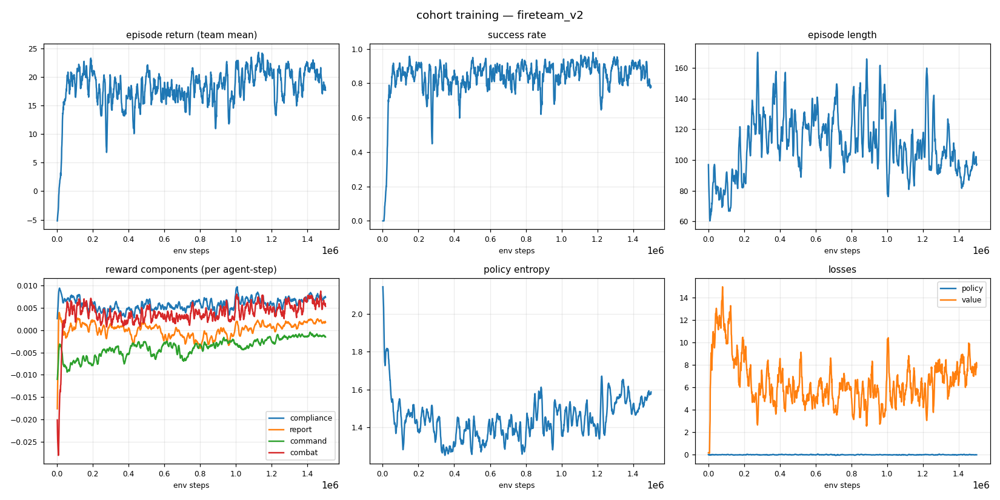
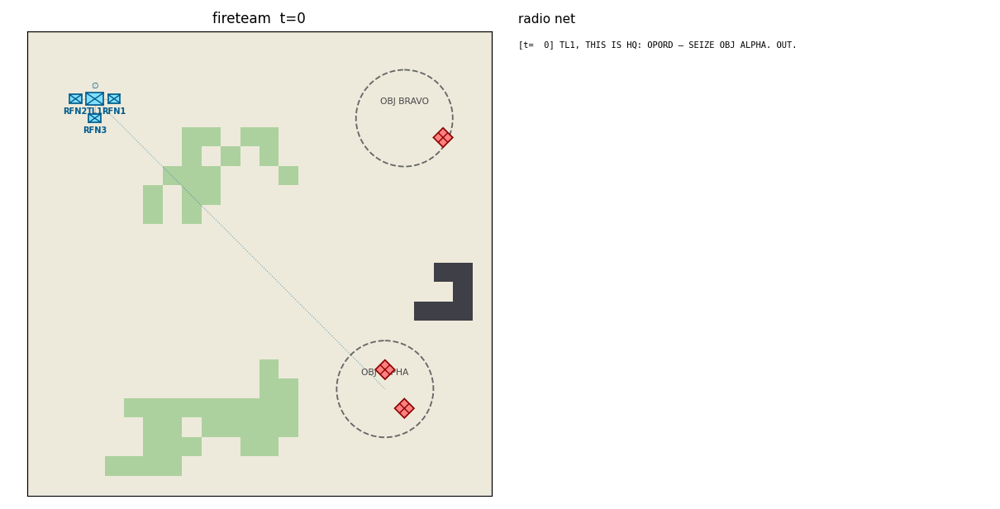
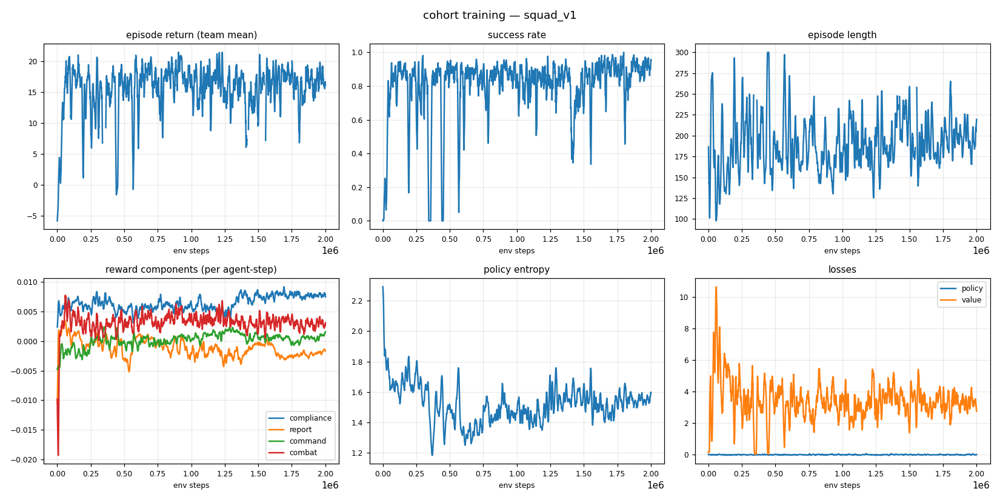
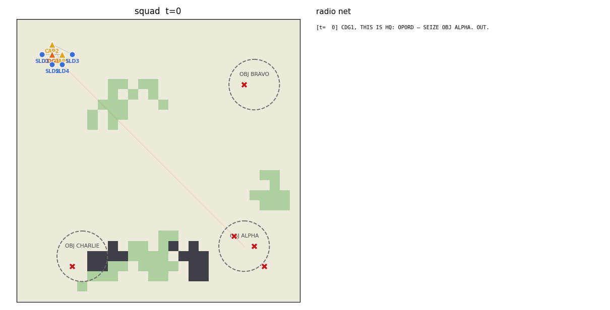

# cohort — a transparent chain-of-command for multi-agent RL

A military cohort of ranked agents learns to behave the way soldiers of their rank should:
**obey** standing orders, **report** what they see up the chain, **derive** doctrine-valid
orders for their subordinates, and fight as a team — while every order and report is a
human-readable radio message. A human commander can read the entire command flow of an
episode as plain voice-procedure text, and can *speak the same language back*:

```
[t=  0] CAP1, THIS IS HQ: OPORD — SEIZE OBJ ALPHA. OUT.
[t=  3] SLD1, THIS IS CAP1: SEIZE OBJ ALPHA. OUT.
[t=  3] CAP1, SLD1: WILCO.
[t= 41] CAP1, THIS IS SLD2: CONTACT, 2 HOSTILES AT (17,16). OVER.
[t= 87] ALL STATIONS: CAP1 IS DOWN.
[t= 87] ALL STATIONS, THIS IS SLD1: CAP1 IS DOWN. I AM TAKING COMMAND.
[t=112] HQ, THIS IS SLD1: SEIZE OBJ ALPHA — COMPLETE. OVER.
```

The same sentence a human types — `CAP1, seize obj bravo` — is parsed, validated against
rank authority, and lands as a mission on the agent, which the trained policy then executes.

## What is guaranteed vs. what is learned

The core design split: **admissibility is enforced, behavior is trained.**

| Enforced by action masking (hard guarantee) | Learned by RL (reward-shaped) |
|---|---|
| A rifleman (SLD) can never issue an order | *When* to move, fire, take cover |
| Leaders can only order their own direct subordinates | *Which* doctrine-valid order fits the situation |
| Orders must be doctrine-derivable from the leader's own mission | Reporting contacts promptly (only *new* intel pays) |
| You cannot FIRE without a visible target, or report a contact you cannot see | Honest MISSION COMPLETE reports (false claims are penalized) |
| MISSION COMPLETE only for missions that have an end state | Keeping every subordinate tasked, avoiding order churn |

## Ranks

The hierarchy follows the French light-infantry structure, plus a base rifleman rank:

| Rank | Position | Authority | Commands |
|---|---|---|---|
| CDU | Commandant d'Unité (company commander) | 6 | ✔ |
| ADU | Adjoint d'Unité (company XO, deputy of CDU) | 5 | ✔ |
| CDS | Chef de Section (platoon leader) | 4 | ✔ |
| SOA | Sous-Officier Adjoint (platoon sergeant, deputy of CDS) | 3 | ✔ |
| CDG | Chef de Groupe (squad leader) | 2 | ✔ |
| CAP | Chef d'Équipe (fire-team leader) | 1 | ✔ |
| SLD | Soldat (rifleman) | 0 | ✖ executes, reports, communicates |

**Succession**: when a leader falls, command devolves automatically — the designated deputy
(ADU/SOA), or the senior living direct subordinate, assumes the fallen leader's *position*:
their effective rank, their subordinates, and their standing mission. The vacancy the
successor leaves behind is filled the same way, recursively, and each promotion is announced
on the net (`I AM TAKING COMMAND`). A rifleman can end up commanding a squad — and the
action mask expands with the acting rank.

## Missions and doctrine

Orders carry one of seven missions: `RECON`, `SEIZE`, `DEFEND`, `OVERWATCH`, `ENGAGE`,
`REGROUP` (rally on leader), `HOLD` (hold position). A leader may only derive subordinate
missions that doctrine allows from its *own* current mission (preference-ordered):

| Own mission | May order subordinates to… |
|---|---|
| RECON | RECON, OVERWATCH, HOLD |
| SEIZE | SEIZE, ENGAGE, OVERWATCH |
| DEFEND | DEFEND, OVERWATCH, HOLD |
| OVERWATCH | OVERWATCH, HOLD |
| ENGAGE | ENGAGE, OVERWATCH |
| REGROUP | REGROUP, HOLD |
| HOLD | HOLD, OVERWATCH |

The doctrine table lives in [`cohort/core/missions.py`](cohort/core/missions.py) — edit it
and the action masks, rewards, and behavior all follow.

## Quickstart

```bash
python -m venv .venv && source .venv/bin/activate
pip install -r requirements.txt

# sanity check
pytest tests/ -q

# train a fire team (CAP + 3 SLD) to seize an objective  (~10 min on CPU)
python -m cohort.training.train --scenario fireteam --total-steps 1500000

# evaluate a checkpoint: metrics + episode GIF + radio transcript
python -m cohort.training.evaluate runs/<run>/ckpt_best.pt --episodes 20 \
    --gif episode.gif --transcript episode.txt

# be the commander: type orders, the trained cohort executes
python -m cohort.play --checkpoint runs/<run>/ckpt_best.pt
```

Training writes everything to `runs/<run-name>/`: `metrics.csv`, `training_curves.png`,
TensorBoard logs (`tensorboard --logdir runs`), checkpoints, and a post-training eval GIF.

## Visualizing

### While training is running

```bash
# live scalars (return, success rate, entropy, losses) in the browser
tensorboard --logdir runs
# → http://localhost:6006

# or regenerate the 6-panel dashboard PNG at any moment (works mid-run)
python -m cohort.viz.plots runs/<run-name>
open runs/<run-name>/training_curves.png     # macOS; xdg-open on Linux

# or watch the raw numbers
tail -f runs/<run-name>/metrics.csv
```

The dashboard shows episode return, success rate, episode length, per-component reward
means (compliance / report / command / combat — *why* the cohort is improving), policy
entropy, and losses. `python -m cohort.training.train` also regenerates it automatically
when the run finishes.

### Watching trained agents

Checkpoints (`ckpt_best.pt`, `ckpt_latest.pt`) are self-contained and reloadable: they
store the model weights plus the network/space metadata and scenario name needed to
rebuild the policy (`cohort.training.train.load_policy`). `ckpt_best.pt` is the rolling
best by success rate; `ckpt_latest.pt` the most recent iteration.

```bash
# metrics over N episodes + an animated GIF + the full radio transcript of one episode
python -m cohort.training.evaluate runs/<run-name>/ckpt_best.pt \
    --episodes 20 --gif episode.gif --transcript episode.txt
open episode.gif        # map, rank-colored units, C2 links + live radio net sidebar
cat episode.txt         # the episode as pure radio traffic

# compare against the untrained baseline
python -m cohort.training.evaluate --random --scenario fireteam

# watch + steer it live in the terminal: type orders, step the sim, read the net
python -m cohort.play --checkpoint runs/<run-name>/ckpt_best.pt
```

A checkpoint trained on one scenario can be loaded in any other (identical observation
and action spaces): `python -m cohort.play --checkpoint runs/fireteam_v2/ckpt_best.pt
--scenario squad` works — and `--init-from` continues training from any checkpoint.

## The command language

Formatting and parsing are inverses — anything an agent says as an order, you can type:

```
CAP1, seize obj alpha          → SEIZE at objective ALPHA
sld2: rally on me              → REGROUP
SLD1, hold position            → HOLD in place
CAP2, cover obj bravo          → OVERWATCH (synonyms: cover, support)
CAP1, hold obj alpha           → DEFEND (holding a *place* ≠ holding position)
```

Synonyms: `take/capture/assault/secure → SEIZE`, `attack/eliminate/neutralize/fix → ENGAGE`,
`scout/observe → RECON`, `guard → DEFEND`, `rally/return → REGROUP`, `halt/stop → HOLD`.
Rank rules apply to humans too: playing as `CAP1` you can order your riflemen, not the
squad leader above you (`PermissionError`). As `HQ` you can order anyone.

## Environment

`CohortEnv` is a [PettingZoo](https://pettingzoo.farama.org) `ParallelEnv` (agent ids are
callsigns). Per agent, per step:

* **Observation** (`Box(131,)` + action mask): own state incl. *effective* rank, standing
  mission + anchor direction, leader, direct subordinates (+ who reported contact),
  currently visible enemies, objectives, comms summary, and a 5×5 terrain patch.
  Crucially, the *team* enemy picture contains only enemies someone has **reported** —
  reporting is instrumentally useful, not just reward-bait.
* **Actions** (`Discrete(97)`, masked): STAY, 4 moves, FIRE, REPORT CONTACT / SITREP /
  MISSION COMPLETE, and 88 order actions (subordinate slot × mission × objective).
* **Rewards** (per agent, decomposed and logged): mission compliance shaping, new-intel
  contact reports, truthful completion reports, doctrine-preferred orders + subordinate
  coverage, combat events, shared terminal success/defeat. Component means are plotted
  per run so you can see *why* the cohort improves.

### Scenarios

| Name | Org | Agents | Mission |
|---|---|---|---|
| `fireteam` | CAP + 3 SLD | 4 | SEIZE OBJ ALPHA (garrisoned) |
| `fireteam_defend` | CAP + 3 SLD | 4 | DEFEND OBJ ALPHA vs. OpFor assault |
| `squad` | CDG + 2 fire teams | 7 | SEIZE with two-echelon command |
| `squad_recon` | CDG + 2 fire teams | 7 | RECON OBJ BRAVO without engaging |
| `section` | CDS + SOA + 2 squads | 16 | SEIZE with three-echelon command |

Add scenarios in [`cohort/config.py`](cohort/config.py) (org chart, map, OpFor, OPORD).

## Training

Self-contained, dependency-light **masked PPO** (PyTorch, no RLlib): one parameter-shared
actor-critic MLP for all agents — rank, mission, and org context live in the observation,
so the network learns *rank-conditional* behavior. Masks are applied at the distribution
level, so admissibility holds during exploration, not just at convergence. Agent death
mid-episode, succession, and truncation bootstrapping are handled in the GAE buffer.

### Results (fireteam, 1.5M steps, ~6 min on a laptop CPU)

See `runs/fireteam_v2/`:





The eval GIF shows the map (rank-colored units, chain-of-command links, mission anchors)
side by side with the live radio net. The full transcript of the episode is written to
`eval_transcript.txt`.

### Results (squad — two command echelons, 7 agents)

`runs/squad_v1/` — the CDG receives the OPORD, tasks its two fire-team leaders, and the
CAPs task their riflemen; the same shared network plays all three roles:





Curriculum tip: checkpoints are scenario-compatible (same spaces) — train `fireteam`
first, then `--init-from runs/fireteam_v2/ckpt_best.pt` for `squad`, and so on up to
`section`.

## Project layout

```
cohort/
  config.py            scenario presets + org chart builders
  core/
    ranks.py           rank ladder, authority, deputies
    missions.py        mission types, doctrine, compliance & completion semantics
    orders.py          radio messages + episode transcript
    language.py        command-language formatter/parser (human ⇄ agent)
    units.py           soldiers, org roster, OpFor, combat, succession
    world.py           terrain grid, LOS, objectives, procedural maps
  env/
    actions.py         global action catalog + per-rank legality masks
    observations.py    per-agent observation builder
    rewards.py         reward weights + per-component ledger
    cohort_env.py      the PettingZoo ParallelEnv
  training/
    ppo.py             masked PPO + GAE buffer (handles agent death)
    train.py           training CLI, metrics, checkpoints
    evaluate.py        eval CLI, GIF + transcript export
  viz/                 frame renderer, GIF writer, training curves
  play.py              interactive commander console
tests/                 66 tests: ranks, language, doctrine, succession, masking,
                       PettingZoo API, rewards, combat, training smoke
legacy/                the previous (RLlib-based) implementation, archived
```

## Provenance

This project is a ground-up rewrite of an older RLlib-based attempt (preserved in
[`legacy/`](legacy/)). The domain model — the French rank structure, doctrine-derived
order decomposition, mission stability ideas — carries over; the environment, training
stack, command language, succession, and tests are new.
