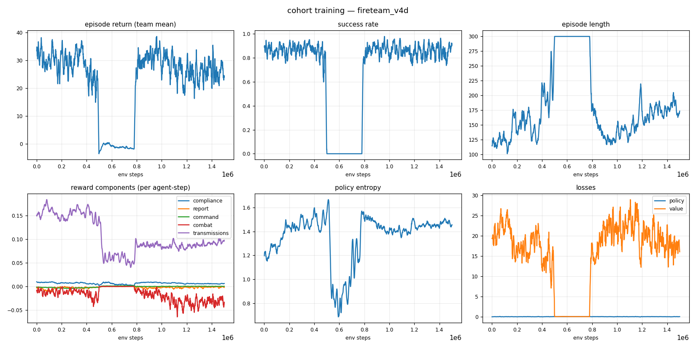
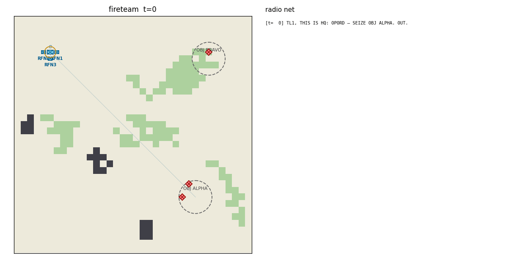
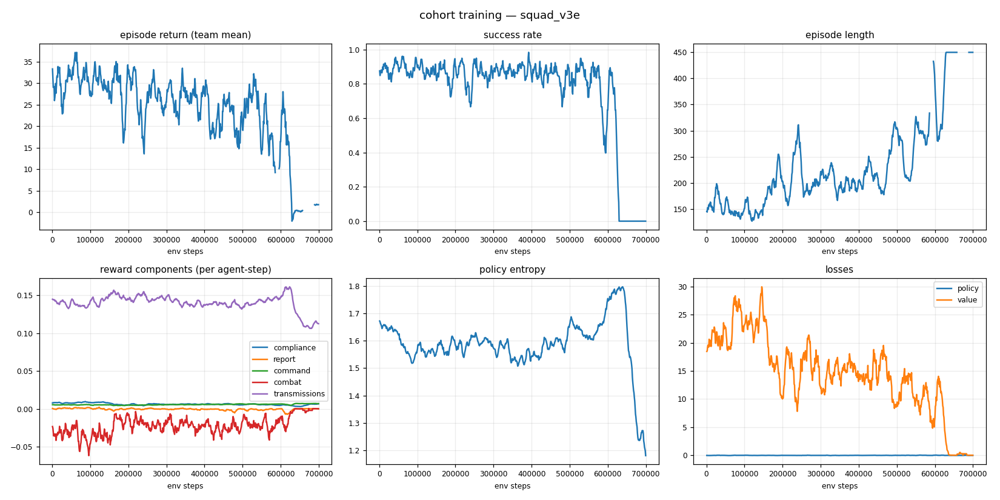
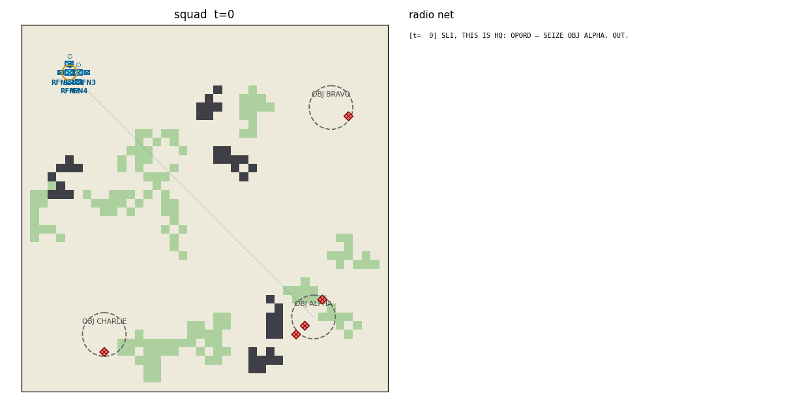
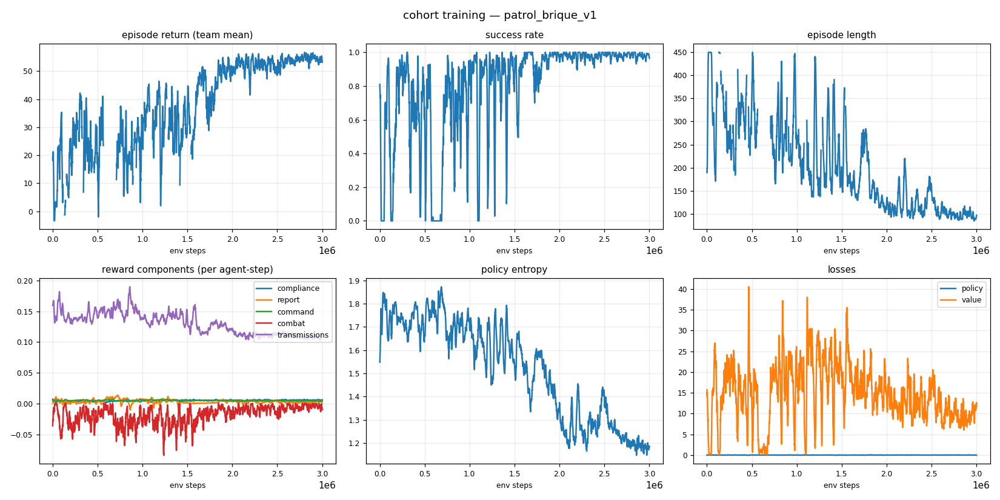
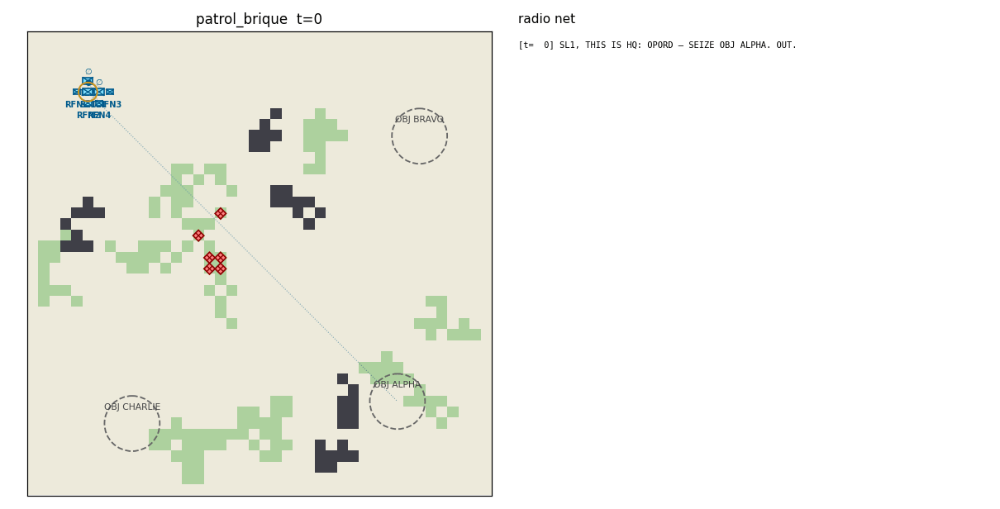

# cohort — a transparent chain-of-command for multi-agent RL


A military cohort of NATO-ranked agents learns to behave the way soldiers of their rank
should: **obey** standing orders, **report** what they see up the chain, **derive**
doctrine-valid orders for their subordinates, and fight as a team — while every order and
report is a human-readable radio message in NATO voice procedure. A human commander can
read the entire command flow of an episode as plain radio traffic, and can *speak the
same language back*:

```
[t=  0] SL1, THIS IS HQ: OPORD — SEIZE OBJ ALPHA. OUT.
[t=  1] TL2, THIS IS SL1: SUPPORT TL1. OUT.
[t=  1] SL1, THIS IS TL2: WILCO. OUT.
[t= 11] SL1, THIS IS TL1: CONTACT, GRID 2106, 1 x ENEMY. OVER.
[t= 87] ALL STATIONS: TL1 IS DOWN. OUT.
[t= 87] ALL STATIONS, THIS IS RFN1: TL1 IS DOWN. I AM ASSUMING COMMAND. OUT.
[t=112] HQ, THIS IS RFN1: SEIZE OBJ ALPHA — COMPLETE. OVER.
[t=112] RFN1, THIS IS HQ: ROGER, SEIZE OBJ ALPHA CONFIRMED. OUT.
```

The same sentence a human types — `TL1, seize obj bravo` — is parsed, validated against
rank authority, and lands as a mission on the agent, which the trained policy then executes.

## What is guaranteed vs. what is learned

The core design split: **admissibility is enforced, behavior is trained.**

| Enforced by action masking (hard guarantee) | Learned by RL (reward-shaped) |
|---|---|
| A rifleman (RFN) can never issue an order | *When* to move, fire, take cover |
| Leaders can only order their own direct subordinates | *Which* doctrine-valid order fits the situation |
| Orders must be doctrine-derivable from the leader's own mission | Reporting contacts promptly (only *new* intel pays) |
| You cannot FIRE without a visible target, or report a contact you cannot see | Honest MISSION COMPLETE reports (false claims are penalized) |
| MISSION COMPLETE only for missions that have an end state | Keeping every subordinate tasked, avoiding order churn |

## Ranks (NATO, STANAG 2116 grades)

| Callsign prefix | Position | Grade | Authority | Commands |
|---|---|---|---|---|
| CO | Company Commander | OF-2 | 6 | ✔ |
| XO | Executive Officer (deputy of CO) | OF-2 | 5 | ✔ |
| PL | Platoon Leader | OF-1 | 4 | ✔ |
| PSG | Platoon Sergeant (deputy of PL) | OR-7 | 3 | ✔ |
| SL | Squad Leader | OR-6 | 2 | ✔ |
| TL | Fire Team Leader | OR-5 | 1 | ✔ |
| RFN | Rifleman | OR-3 | 0 | ✖ executes, reports, communicates |

**Succession**: when a leader falls, command devolves automatically — the designated
deputy (XO/PSG), or the senior living direct subordinate, assumes the fallen leader's
*position*: their effective rank, their subordinates, and their standing mission. The
vacancy the successor leaves behind is filled the same way, recursively, and each
promotion is announced on the net (`I AM ASSUMING COMMAND`). A rifleman can end up
commanding a squad — and the action mask expands with the acting rank.

**Humans in the ranks**: by default the root commander is a *human* embodied in the sim
(`ScenarioSpec.root_human`) — marked with a gold ring in every view, observable to
teammates (own/leader is-human observation flags). An org must satisfy the
humans-outrank-all-non-humans invariant (validated at roster build). A human's death
costs every present agent `RewardConfig.human_death` (−25, mission-failure scale) on
top of the normal penalties; the episode continues and succession exercises — the
cohort learns that keeping the commander alive is part of the mission.

## Missions and doctrine (MICAT / PROTERRE)

Orders carry one of the eleven MICAT tasks of the French PROTERRE manual
([`docs/manuel-proterre.pdf`](docs/manuel-proterre.pdf) — English names, PROTERRE
semantics; full doctrine with manual page references in
[`docs/missions.md`](docs/missions.md)):

`RECON` (RECONNAÎTRE — get intel, *may* engage), `SCREEN` (ÉCLAIRER — intel *without*
engaging, weapons tight), `OBSERVE` (SURVEILLER — static watch, detect & alert),
`SUPPORT` (APPUYER — **unit-targeted** fire support: the order names a friendly element),
`COVER` (COUVRIR — flank guard on an objective), `DEFEND` (TENIR), `DENY` (INTERDIRE —
section-level area denial, authority ≥ 2 only), `SEIZE`, `CLEAR`, `RALLY`, `HOLD`.

A leader may only derive subordinate tasks that doctrine allows from its *own* current
mission (preference-ordered):

| Own mission | May order subordinates to… |
|---|---|
| RECON | RECON, SUPPORT, OBSERVE, SCREEN |
| SCREEN | SCREEN, OBSERVE, HOLD |
| OBSERVE | OBSERVE, COVER, HOLD |
| SUPPORT | SUPPORT, OBSERVE, HOLD |
| COVER | COVER, OBSERVE, HOLD |
| DEFEND | DEFEND, SUPPORT, OBSERVE, HOLD |
| DENY | DEFEND, COVER, SUPPORT, OBSERVE |
| SEIZE | SEIZE, CLEAR, SUPPORT, OBSERVE |
| CLEAR | CLEAR, SUPPORT |
| RALLY | RALLY, HOLD |
| HOLD | HOLD, OBSERVE |

(DENY derives DEFEND, not itself: INTERDIRE is a section mission executed through
group-level TENIR/COUVRIR — no echelon can pass DENY down.) The doctrine table lives in
[`cohort/core/missions.py`](cohort/core/missions.py) — edit it and the action masks,
rewards, and behavior all follow.

SUPPORT is mechanically real — *pas un pas sans appui*: a supporter in position
(≤ 10 cells of the supported soldier, LOS to it) degrades any attacker firing at the
supported element from inside its 8-cell umbrella (accuracy ×0.7), and enables focus
fire (second and later friendly shooters at the same target in the same step: hit
probability ×1.15, capped at 0.95). Both effects die the moment the supporter leaves
its station, and are visible to external observers via the oracle's
`supporting`/`supported` tags.

## Quickstart

```bash
python -m venv .venv && source .venv/bin/activate
pip install -r requirements.txt

# sanity check
pytest tests/ -q

# train a fire team (TL + 3 RFN) to seize an objective  (~10 min on CPU)
python -m cohort.training.train --scenario fireteam --total-steps 1500000

# evaluate a checkpoint: metrics + episode GIF + radio transcript
python -m cohort.training.evaluate runs/<run>/ckpt_best.pt --episodes 20 \
    --gif episode.gif --transcript episode.txt

# be the commander: type orders, the trained cohort executes
python -m cohort.play --checkpoint runs/<run>/ckpt_best.pt
```

Training writes everything to `runs/<run-name>/`: `metrics.csv`, `training_curves.png`,
TensorBoard logs (`tensorboard --logdir runs`), checkpoints, and a post-training eval GIF.

## Visualizing

### The interactive dashboard

```bash
python -m cohort.viz.dashboard          # opens http://localhost:8787
```

One command, no extra dependencies, works offline. Unit symbology follows **NATO APP-6 /
MIL-STD-2525**: friendly units are blue rectangle frames with the infantry saltire and an
echelon indicator (∅ team, ● squad, ●●● platoon, | company); hostiles are red diamonds;
reported-but-unseen contacts are dashed diamonds (suspected). Two views:

* **Training** — live-refreshing charts for every run in `runs/`: return, success
  rate, episode length, per-component rewards, entropy, losses — usable *while*
  a training run is going.
* **Episode** — simulate an episode with any checkpoint (or the random baseline),
  any scenario, any seed (reproducible), then explore it like a film:
  play/pause/scrub/step, click any **agent** (health, ammo, effective rank with NATO
  grade, mission, the exact action it took, its per-step reward broken into named
  components), any **enemy** (who has spotted it, whether it's been reported onto the
  team picture), any **objective** or terrain cell. Overlay toggles for chain-of-command
  links, mission anchors, health/ammo bars, vision + line-of-sight, the reported
  enemy picture, comm flashes, and movement trails. A synced radio-net log
  (filterable, click a message to jump to its moment) and an event timeline
  (rewards + contacts/orders/casualties) round it out.

* **Command** — the live mode: start a session with any checkpoint, advance the
  simulation (+1/+5/+20 or auto, with pause-on-CONTACT), and **type orders on the
  net while it runs** — `TL1, seize obj bravo` as HQ or as any commander callsign,
  with WILCOs landing in the radio log and rank violations rejected in the UI.
  The browser equivalent of `python -m cohort.play`.

It is equally a debugging tool: both reward exploits found during development
are the kind of thing the Episode view makes visible in seconds (an agent's
reward components are shown red/green at every step).

### Without the dashboard (headless / scripting)

```bash
# live scalars (return, success rate, entropy, losses) in the browser
tensorboard --logdir runs
# → http://localhost:6006

# or regenerate the 6-panel dashboard PNG at any moment (works mid-run)
python -m cohort.viz.plots runs/<run-name>
open runs/<run-name>/training_curves.png     # macOS; xdg-open on Linux

# or watch the raw numbers
tail -f runs/<run-name>/metrics.csv
```

### Watching trained agents

Checkpoints (`ckpt_best.pt`, `ckpt_latest.pt`) are self-contained and reloadable: they
store the model weights plus the network/space metadata and scenario name needed to
rebuild the policy (`cohort.training.train.load_policy`). `ckpt_best.pt` is the rolling
best by success rate; `ckpt_latest.pt` the most recent iteration.

```bash
# metrics over N episodes + an animated GIF + the full radio transcript of one episode
python -m cohort.training.evaluate runs/<run-name>/ckpt_best.pt \
    --episodes 20 --gif episode.gif --transcript episode.txt
open episode.gif        # APP-6 map + live radio net sidebar
cat episode.txt         # the episode as pure radio traffic

# compare against the untrained baseline
python -m cohort.training.evaluate --random --scenario fireteam
```

Every evaluation also computes the **behavioral metrics suite** (obedience
latency, report precision/recall, doctrine preference, false-COMPLETE rate,
succession recovery, subordinate coverage, human exposure) over the same
episodes — printed as a table, written to `runs/<run>/behavior.json`, and
shown in the dashboard's Episode sidebar. Definitions and the published-
checkpoint baseline: [`docs/metrics.md`](docs/metrics.md). `--no-behavior`
skips it.

```bash

# watch + steer it live in the terminal: type orders, read the net
python -m cohort.play --checkpoint runs/<run-name>/ckpt_best.pt
```

A checkpoint trained on one scenario can be loaded in any other (identical observation
and action spaces): `python -m cohort.play --checkpoint runs/fireteam_v4/ckpt_best.pt
--scenario squad` works — and `--init-from` continues training from any checkpoint.

## The command language (NATO voice procedure)

Formatting and parsing are inverses — anything an agent says as an order, you can type:

```
TL1, seize obj alpha           → SEIZE at objective ALPHA
rfn2: rally on me              → RALLY
RFN1, hold position            → HOLD in place
TL2, support TL1               → SUPPORT (unit-targeted: names a friendly element)
TL2, cover obj bravo           → OBSERVE (the retired OVERWATCH phrases stay usable)
TL1, cover flank obj bravo     → COVER (flank guard)
TL1, hold obj alpha            → DEFEND (holding a *place* ≠ holding position)
```

Synonyms: `take/capture/assault/secure → SEIZE`, `destroy/attack/engage/eliminate/
neutralize/fix → CLEAR`, `scout → RECON`, `eclairer → SCREEN`, `watch/overwatch/
surveiller → OBSERVE`, `appuyer/cover for <callsign> → SUPPORT`, `couvrir/flank →
COVER`, `guard/retain/tenir → DEFEND`, `interdict/interdire → DENY`,
`regroup/assemble/return → RALLY`, `halt/stop → HOLD`. Reports use ACP-125-style
prowords (THIS IS, WILCO, OVER, OUT, ALL STATIONS) and four-digit GRID references.
Rank rules apply to humans too: playing as `TL1` you can order your riflemen, not the
squad leader above you (`PermissionError`). As `HQ` you can order anyone.

## Environment

`CohortEnv` is a [PettingZoo](https://pettingzoo.farama.org) `ParallelEnv` (agent ids are
callsigns). Per agent, per step:

* **Observation** (`Box(137,)` + action mask): own state incl. *effective* rank and an
  is-human flag, standing mission + anchor direction, leader (incl. whether the leader
  is human), direct subordinates (+ who reported contact), currently visible enemies,
  objectives, comms summary, and a 5×5 terrain patch. Crucially, the *team* enemy
  picture contains only enemies someone has **reported** — reporting is instrumentally
  useful, not just reward-bait.
* **Actions** (`Discrete(157)`, masked): STAY, 4 moves, FIRE, REPORT CONTACT / SITREP /
  MISSION COMPLETE, and 148 order actions (subordinate slot × mission × objective, plus
  the unit-targeted `SUPPORT` pairings).
* **Rewards** (per agent, decomposed and logged): mission compliance shaping, new-intel
  contact reports, truthful completion reports, doctrine-preferred orders + subordinate
  coverage, combat events, shared terminal success/defeat. Component means are plotted
  per run so you can see *why* the cohort improves.
* **Comms model** (`ScenarioSpec.comm_model`): `"global"` (default) is a single
  perfectly reliable net — every station hears everything. `"range"` makes audibility
  per-listener (euclidean `comm_range`; HQ is a high-power station): CONTACT reports
  feed only the pictures of stations in earshot, and an order to an out-of-earshot
  subordinate is transmitted but never received — no WILCO comes back, so silence
  carries information.
* **Comms discipline**: the net is a single frequency — at most one *learned*
  transmission (CONTACT / SITREP / MISSION COMPLETE / order) per tick, arbitrated by
  priority (CONTACT > DONE > orders > SITREP, ties by agent order); losers get a NET
  BUSY (dropped, free, externally visible in the oracle). Airtime costs: every emitted
  learned transmission draws a small penalty; auto-traffic (WILCO, verdicts, CASUALTY,
  succession) is protocol and stays free. CONTACT credit is deduplicated — the first
  accurate report of an enemy pays in full, a refresh of aging intel is worth exactly
  0, re-reporting fresh intel is penalized noise. See
  [docs/command_language.md](docs/command_language.md).
* **Completion reporting is load-bearing**: when the root-mission success condition is
  first met, the episode stays open for a short window (`ScenarioSpec.grace_window`,
  default 12 steps). A truthful `MISSION COMPLETE` from the senior agent — judged
  against the *team* end state and confirmed by HQ on the net — ends the episode that
  step and earns a bonus; otherwise the episode ends as a success at the window's close
  (speed bonus anchored at the moment the condition was met, so winning never depends
  on reporting — but reporting is what ends the operation *on the net*).

### Scenarios

| Name | Org | Agents | Map | Mission |
|---|---|---|---|---|
| `fireteam` | TL + 3 RFN | 4 | 36×36 | SEIZE OBJ ALPHA (garrisoned) |
| `fireteam_defend` | TL + 3 RFN | 4 | 36×36 | DEFEND OBJ ALPHA vs. OpFor assault |
| `squad` | SL + 2 fire teams | 7 | 42×42 | SEIZE with two-echelon command |
| `squad_recon` | SL + 2 fire teams | 7 | 42×42 | RECON OBJ BRAVO (may engage) |
| `squad_screen` | SL + 2 fire teams | 7 | 42×42 | SCREEN OBJ BRAVO — intel *without* engaging |
| `platoon` | PL + PSG + 2 squads | 16 | 54×54 | SEIZE with three-echelon command |
| `patrol_brique` | SL + 2 fire teams | 7 | 42×42 | SEIZE across ambush country vs. a BRIQUE band + mines |
| `defend_brique` | TL + 3 RFN | 4 | 36×36 | DEFEND vs. a harassing/raiding BRIQUE band + mines |

Add scenarios in [`cohort/config.py`](cohort/config.py) (org chart, map, OpFor, OPORD).

## Training

Self-contained, dependency-light **masked PPO** (PyTorch, no RLlib): one parameter-shared
actor-critic MLP for all agents — rank, mission, and org context live in the observation,
so the network learns *rank-conditional* behavior. Masks are applied at the distribution
level, so admissibility holds during exploration, not just at convergence. Agent death
mid-episode, succession, and truncation bootstrapping are handled in the GAE buffer.

All published results below are from the **v1.4 environment** (full MICAT mission set,
SUPPORT mechanics, human commanders, rank-weighted casualties, ×1.5 maps) — the space
break made every pre-v1.4 checkpoint incompatible, so every scenario was retrained from
scratch (fresh nets; pre-v1.4 runs stay on disk and in git history for provenance).
Numbers are sampled-policy evaluation success over N=100 episodes with a 95% CI;
`ckpt_best` is the rolling-best checkpoint of each run. The fireteam and squad
results were re-published under the **A4 comms discipline** (net-busy arbitration +
transmission cost + CONTACT dedup — the env every number below is measured in);
the other scenarios' checkpoints predate A4 and keep their v1.4 numbers (measured
in the pre-A4 env).

A campaign-wide caveat, documented in the ROADMAP (D4): under the v1.4 death economics
(a human commander's death costs every agent −25) the combat-heavy scenarios train
*unstably* — converged policies repeatedly collapsed mid-run into passive equilibria
(squad twice, recon once, defend oscillating; the collapse onset coincides with bursts
of human-commander deaths). The rolling-best checkpoints capture the policies at their
peaks; the training curves show the collapses honestly.

### Results (fireteam)

`runs/fireteam_v4d/` — **83% ± 7** (N=100), `fireteam_v4` fine-tuned 1.5M steps under
the A4 comms discipline. The net transformed: CONTACT reports fell from 22.6 to **2.5
per episode** (duplicate rate 0.92 → 0.51 — the storm is gone), total learned
transmissions halved (0.18 → 0.09 per agent-step), SITREPs stayed within doctrine at
0.98 per agent per 25 steps. **Below the pre-discipline number (92% ± 5, regression
bound −3)**, documented honestly: the fine-tune took a D4-style mid-run collapse
(0.93 rolling → 0 at ~0.6M) and self-recovered to 87% rolling but not to its peak;
the diagnosed gentler rerun (`runs/fireteam_v4e/`, `--lr 5e-5 --ent-coef 0.003`)
collapsed terminally at ~0.7M — retrain and adjustment both spent (ROADMAP A4/D4).
The operation still ends on the net (~4.7 DONE reports per episode):

```
[t=146] HQ, THIS IS TL1: SEIZE OBJ ALPHA — COMPLETE. OVER.
[t=146] TL1, THIS IS HQ: ROGER, SEIZE OBJ ALPHA CONFIRMED. OUT.
```





The eval GIF shows the map (APP-6 unit symbols, gold-ringed human commander,
chain-of-command links, mission anchors) side by side with the live radio net. The full
transcript of the episode is written to `eval_transcript.txt`.

### Results (squad — two command echelons, 7 agents)

`runs/squad_v3e/` — **84% ± 7** (N=100), fine-tuned from `squad_v3b` under the A4
comms discipline: SITREPs fell from 2.9 to **0.74 per agent per 25 steps** and total
learned transmissions halved (0.26 → 0.13 per agent-step) with **zero success
regression** vs. its parent (84% ± 7). The SL receives the OPORD, tasks its fire-team
leaders (SUPPORT pairings included: `TL1, THIS IS SL1: SUPPORT TL2. OUT.`), and the
TLs task their riflemen — now one transmission per tick, on a readable net. Both
discipline fine-tunes collapsed D4-style (the first at 0.1M, the diagnosed gentler
rerun at 0.6M after holding 0.81–0.90 for 0.6M steps; `comp_combat` shows the
human-death shock bursts before the onset); the published checkpoint is the 0.94
rolling peak, and CONTACT dedup — only 51k discipline steps deep — still re-reports
fresh intel at a 0.83 rate (documented A4 residual; the fireteam run shows 1.5M steps
erase the storm entirely). Ancestors `runs/squad_v3b/` (84% ± 7, pre-discipline) and
`runs/squad_v3/` (85% ± 7) are kept alongside, with the collapsed `runs/squad_v3d/`
for the D4 record.





### Results (platoon — three command echelons, 16 agents)

`runs/platoon_v2/` — **91% ± 6** (N=100, zero defeats, 10.9/16 mean survivors),
trained by curriculum from the squad checkpoint at `--lr 1e-4` (seed 7). Curriculum
transfer across the space break was instant: >80% rolling within 25k steps, 93% by
600k. The full chain activates within ~5 steps of the OPORD — HQ → PL1, PL1 tasks
PSG1/SLs (including `PSG1, THIS IS PL1: SUPPORT SL1. OUT.`), SLs task their TLs, TLs
task their riflemen — one shared network playing every echelon. The planned 7M budget
was cut at ~0.7M: the policy had converged (and the post-convergence collapse pattern
argues against training past it — rolling was already dipping when the run was
stopped; `ckpt_best` holds the peak).


### Results (defense, reconnaissance & screen)

`runs/fireteam_defend_v5/` — **73% ± 9** (N=100, 3.3/4 mean survivors; 21% timeouts,
6% defeats). **Below the v1.2 number (91% ± 6)**, documented honestly: on the ×1.5 map
under the new death economics the first training abandoned the objective outright
(oracle: enemies parked *on* the objective at full health while defenders farmed
location-free SUPPORT/HOLD posture compliance 25 cells away). The diagnosed adjustment
— `RewardConfig.objective_lost`, a per-step bleed for every agent while a living enemy
stands on a DEFEND/DENY root objective — restored a real defense (rolling peaked at
79%, oscillating 0–79% thereafter), and the oracle confirms the deaths happen *at* the
position again (14/22 within 6 cells, all within 10 — none in flight).

`runs/squad_recon_v4b/` — **85% ± 7** (N=100). PROTERRE RECONNAÎTRE *may engage*; the
recon squad observes from concealment and fights only when it must. Retrained under the
issue-#9 **team adjudication** (a root-held RECON/SCREEN completes on the squad's
*aggregated* observation, and the commander's in-position credit follows the team —
see `docs/missions.md`): on the 30-episode assurance protocol (seeds 500–529) the
human commander now dies **2/30** episodes (was 9/30 — the outlier that motivated the
issue) and **22/30** episodes end in the root's HQ-confirmed MISSION COMPLETE (was
20/30). The published checkpoint is the 183k-step snapshot of a fine-tune from
`squad_recon_v3` (`--lr 1e-4 --ent-coef 0.02`), selected by the measured
commander-exposure metric among periodic snapshots: later snapshots *re-learn*
exposure (deaths 7–9/30) — RECON's may-engage combat pay still pulls the root forward
once adjudication no longer requires it. A first fine-tune (`runs/squad_recon_v4/`,
default entropy) collapsed terminally at ~0.5M — the recon D4 signature — with its
rolling-best still carrying parent exposure (7/30); kept for the record, as is
`runs/squad_recon_v3/` (88% ± 6, pre-#9).

`runs/squad_screen_v2/` — **92% ± 5** (N=100) on the ÉCLAIRER scenario: intel
*without* engaging. Fine-tuned from `squad_screen_v1b` under the issue-#9 team
adjudication: human-commander deaths **2/30** on the assurance protocol (was 4/30),
**27/30** episodes end in the root's HQ-confirmed COMPLETE (was 26/30), zero failed
episodes over the 30 seeds. The fire-discipline measurement stands on the parent
`runs/squad_screen_v1b/` (93% ± 5; oracle-verified over 30 episodes: 0.016
shots/agent-step total, **84% riposte while already detected** — the manual's "ne fait
ouvrir le feu que pour riposter", p. 32 — and **0.0025 shots/agent-step** unprovoked
from concealment, meeting the strict <0.01 bar for unprovoked fire only), of which v2
is a 110k-step gentle continuation (`runs/squad_screen_v1/` kept alongside).

### Asymmetric warfare (BRIQUE)

The PROTERRE manual defines the threat PROTERRE units are built against
([`docs/manuel-proterre.pdf`](docs/manuel-proterre.pdf), p. 9 "LA MENACE" — the
« BRIQUE » enemy of the armée de terre's scenario 3): *armed bands of 5–20 with light
individual and collective weapons*, capable of coups de main on installations, limited
raids to destroy communications and depots, harassment of police and military forces
with improvised means *including mines and traps*, and high-psychological-impact
actions. `opfor_mode="brique"` implements exactly that as an environment-side OpFor
(blue's spaces are untouched — every v1.4/v1.5 checkpoint still loads):

* a **flat band** (no hierarchy, no chain of command — the structural opposite of the
  cohort) driven by a band-level intent machine: **LURK** (hide in cover, avoid
  detection) → **AMBUSH** (posted at a chokepoint on blue's predicted route, weapons
  holstered until a blue unit is inside `ambush_range` *or the ambush is compromised*,
  then a volley) → **HARASS** (1–2 shots from max range, displace to new cover) ⇄
  **RAID** (move fast onto the objective, linger sabotaging, withdraw) → **SCATTER**
  (break contact to the map edges — only under 30% strength: the band accepts
  casualties a regular force would not);
* **casualty-maximizing target selection**: the human commander first, then wounded,
  then isolated blue units — the band shoots for psychological impact, which couples
  directly into the cohort's human-death economics;
* **mines/traps** (`ScenarioSpec.n_traps`): hidden cells on blue's likely route or the
  position's approaches; the first friendly stepping on one takes 40 damage and the
  umpire broadcasts `ALL STATIONS: RFN2 HIT A DEVICE AT GRID 1110. OUT.` — devices are
  oracle ground truth from step 0 and **never** appear in blue observations (the
  assurance layer's inference target);
* **asymmetric terminal semantics** (DEFEND vs. a band): success = band destroyed OR
  scattered with contact fully broken, while the objective is held — a hit-and-run
  enemy does not have to be annihilated to be defeated, but it must be *out of the
  fight* (see [docs/architecture.md](docs/architecture.md)).

The two BRIQUE scenarios exercise the manual's own counter-drills (pp. 18–19:
*réaction à une embuscade*, *le groupe rompt le contact*): `patrol_brique` marches a
squad through ambush country to seize a far objective (react-to-ambush, break-contact,
SUPPORT bounding), `defend_brique` holds a position against a probing, harassing,
raiding band.

**Results** (N=100, sampled policy, 95% CI; both fine-tuned 3M steps at `--lr 1e-4`
under the D4 rolling-best fix):

`runs/patrol_brique_v1/` — **99% ± 2** (99/100, 6.4/7 mean survivors), fine-tuned from
`squad_v3e`. Oracle before → after (30 fixed-seed episodes, parent vs. trained): total
casualties **3.2 → 0.8 per episode**, ambushes sprung at all **29/30 → 15/30** (the
patrol learned routes that refuse the kill zone), casualties inside the sprung-ambush
window 1.2 → 0.8, **trap casualties 0.63 → 0.0 per episode** (the mined route corridor
is avoided outright), SUPPORT taskings during movement **1.8 → 3.9 per episode**
(`TL1, THIS IS SL1: SUPPORT TL2. OUT.` lands at t=11 of the eval transcript — bounding
starts supported). The mid-run training was rough — rolling oscillated 0.06–0.94 for
the first ~1.5M steps (the D4 shock signature, amplified by the band deliberately
targeting the human commander) before converging to 0.96–1.0.

`runs/defend_brique_v1/` — **87% ± 7** (`ckpt_best`, saved at 2.1M; the final
checkpoint evaluates the same, 88% ± 6 — zero defeats either way, 3.9/4 mean
survivors), fine-tuned from `fireteam_defend_v5` (whose own baseline on this band was
73%). Oracle: casualties 0.43 → **0.13 per episode**, the band ends **scattered or
destroyed in 29/30 episodes** (4.1/5 members killed on average), and trap casualties
stay 0 — the defenders never sortie into their own mined approaches (position
discipline holding). This scenario is also the D4 fix working as designed: the metrics
log shows rolling pinned at 1.0 by the parent in the very first window — the old gate
would have frozen `ckpt_best` at ~1k steps; the new full-turnover gate saved it at its
genuine 2.1M peak.





Curriculum tip: checkpoints are scenario-compatible (same spaces) — train `fireteam`
first, then `--init-from runs/fireteam_v4/ckpt_best.pt` for `squad`, and so on up to
`platoon` (use a lower `--lr` when fine-tuning a converged checkpoint).

### Does the hierarchy actually help? (ablation)

Measured, not assumed: a 3-arm × 3-seed ablation on the squad scenario (same
network, same spaces, 2.5M steps from scratch each) compared the shipped system
against a hierarchy *without* doctrine masks and against a flat, order-less team
where every agent gets the OPORD directly. Structured command wins on **outcome
robustness** (N=100 success 0.92 ± 0.01 vs 0.85 ± 0.06 flat, which wipes 2.2× as
often) and on **interpretability** (100% doctrine-valid radio traffic by
construction vs 40% without masks; completion reporting only survives under
masks) — but not on raw speed-to-threshold, where the all-tasked flat team is
fastest on a scenario this small. Full tables, learning curves, and the honest
verdict: [docs/ablation.md](docs/ablation.md).

### Can you predict the cohort from its radio net? (transparency probe)

The founding promise — the net alone explains the behavior — is measured, not
asserted: `python -m cohort.probe runs/<run>/ckpt_best.pt` replays evaluation
episodes and scores a deterministic net-following reader (transcript-so-far +
briefing material only, no positions) at predicting each agent's next-15-step
destination and posture, against majority and random baselines. The honest
verdict is mixed: posture beats random on all 8 published checkpoints, and
stable-anchor defenses are genuinely readable (the defend-BRIQUE team leader is
predictable at 0.99) — but destination *loses* to an OPORD-only reader
everywhere, because doctrine-valid order traffic churns objectives faster than
execution binds them. Method, tables, failure modes:
[docs/transparency.md](docs/transparency.md).

## Project layout

```
cohort/
  config.py            scenario presets + org chart builders
  core/
    ranks.py           NATO rank ladder, STANAG grades, deputies, echelon marks
    missions.py        NATO tactical tasks, doctrine, compliance & completion semantics
    orders.py          radio messages + episode transcript
    language.py        command-language formatter/parser (NATO voice procedure)
    units.py           soldiers, org roster, OpFor, combat, succession
    world.py           terrain grid, LOS, objectives, procedural maps
  env/
    actions.py         global action catalog + per-rank legality masks
    observations.py    per-agent observation builder
    rewards.py         reward weights + per-component ledger
    cohort_env.py      the PettingZoo ParallelEnv
  metrics.py           behavioral metrics suite (docs/metrics.md): obedience,
                       reporting P/R, doctrine preference, succession, exposure
  probe.py             transparency probe (docs/transparency.md): predict behavior
                       from the radio net alone, scored vs honest baselines
  training/
    ppo.py             masked PPO + GAE buffer (handles agent death)
    train.py           training CLI, metrics, checkpoints, --init-from
    evaluate.py        eval CLI, GIF + transcript export, behavior.json
  viz/                 APP-6 frame renderer, GIF writer, training curves,
                       interactive dashboard (dashboard.py + dashboard.html)
  play.py              interactive commander console
tests/                 267 tests: ranks, language, doctrine, succession, masking,
                       PettingZoo API, rewards, combat, SUPPORT mechanics, humans,
                       rank-weighted casualties, completion reporting, comms range,
                       SITREP cadence, BRIQUE band + traps, behavioral metrics,
                       hierarchy-ablation arms, transparency probe, dashboard,
                       training smoke
legacy/                the previous (RLlib-based) implementation, archived
```

## Roadmap

Planned work and its advancement are tracked in [ROADMAP.md](ROADMAP.md) — current
flagship item: training the three-echelon `platoon` scenario by curriculum.

## Provenance

This project is a ground-up rewrite of an older RLlib-based attempt (preserved in
[`legacy/`](legacy/)). The domain model — a ranked chain of command with doctrine-derived
order decomposition — carries over; the original French rank nomenclature (CDU/CDS/CDG…)
was translated to NATO standards (ranks, tactical tasks, voice procedure, APP-6
symbology) in v1.1. The environment, training stack, command language, succession, and
tests are new.
