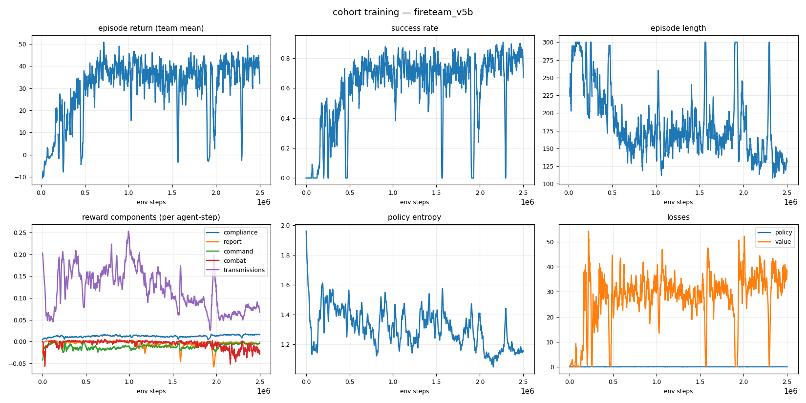
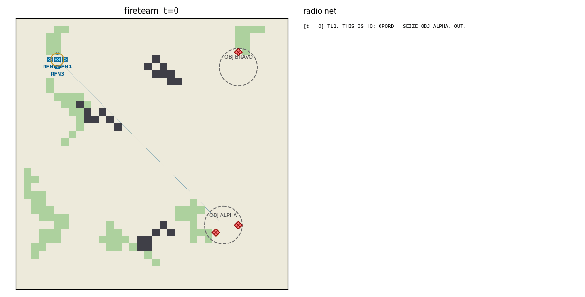
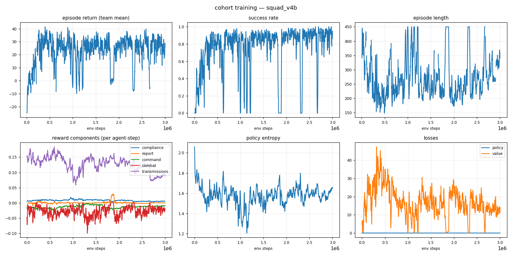
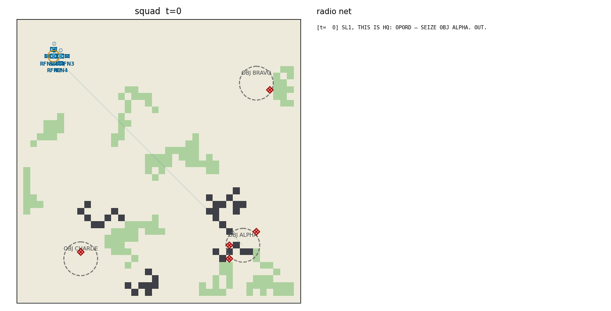
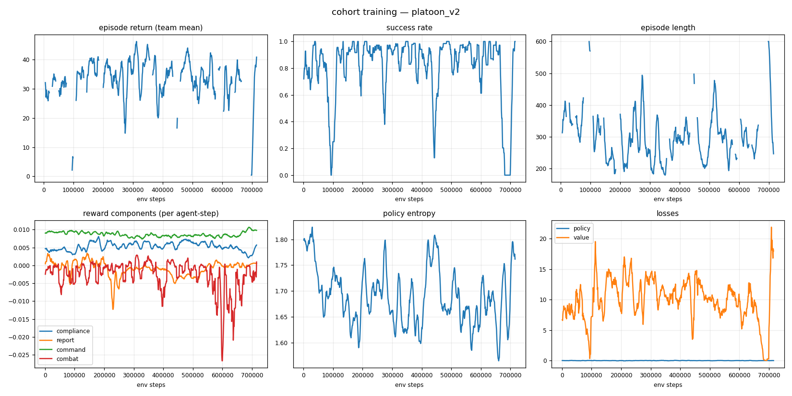
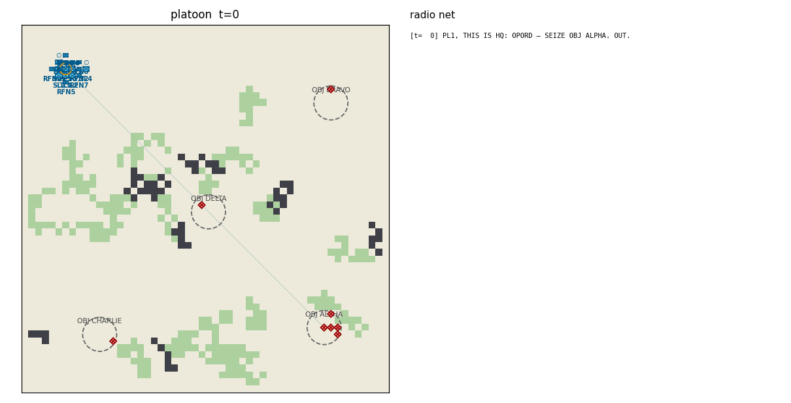
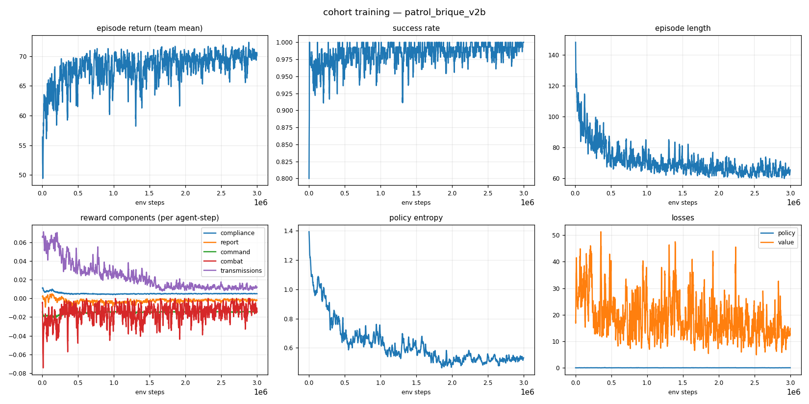
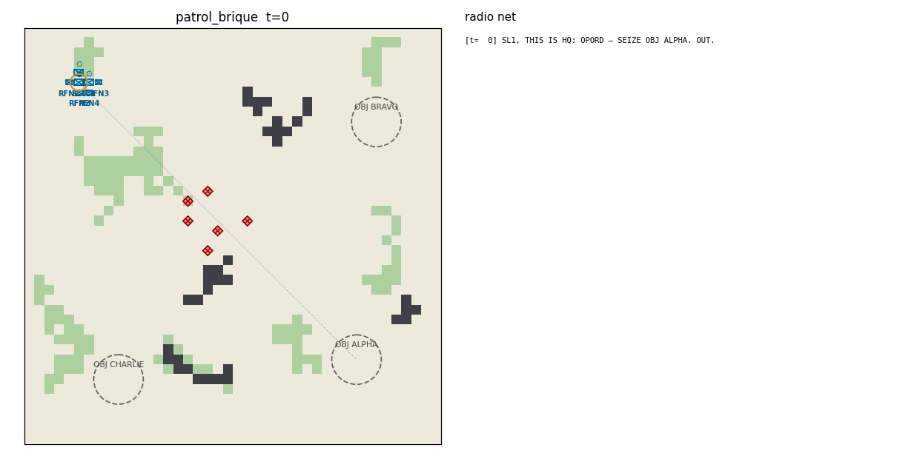

# cohort — a transparent chain-of-command for multi-agent RL


A military cohort of NATO-ranked agents learns to behave the way soldiers of their rank
should: **obey** standing orders, **report** what they see up the chain, **derive**
doctrine-valid orders for their subordinates, and fight as a team — while every order and
report is a human-readable radio message in NATO voice procedure. A human commander can
read the entire command flow of an episode as plain radio traffic, and can *speak the
same language back*:

```
[t=  0] SL1, THIS IS HQ: OPORD — SEIZE OBJ ALPHA. OUT.
[t=  1] TL2, THIS IS SL1: SUPPORT TL1. OUT.
[t=  1] SL1, THIS IS TL2: WILCO. OUT.
[t= 11] SL1, THIS IS TL1: CONTACT, GRID 2106, 1 x ENEMY. OVER.
[t= 87] ALL STATIONS: TL1 IS DOWN. OUT.
[t= 87] ALL STATIONS, THIS IS RFN1: TL1 IS DOWN. I AM ASSUMING COMMAND. OUT.
[t=112] HQ, THIS IS RFN1: SEIZE OBJ ALPHA — COMPLETE. OVER.
[t=112] RFN1, THIS IS HQ: ROGER, SEIZE OBJ ALPHA CONFIRMED. OUT.
[t=112] RFN1, THIS IS HQ: ENDEX. OUT.
```

The last two lines are two different acts and the distinction is the point: the
rifleman who inherited the fire team **reported**, and HQ **ended the
operation**. Every successful operation gets that ENDEX, on every scenario — so
a win is never something only the scoreboard knows about. What the cohort's own
report buys is closing early, and it is priced.

The same sentence a human types — `TL1, seize obj bravo` — is parsed, validated against
rank authority, and lands as a mission on the agent, which the trained policy then executes.

## What is guaranteed vs. what is learned

The core design split: **admissibility is enforced, behavior is trained.**

| Enforced by action masking (hard guarantee) | Learned by RL (reward-shaped) |
|---|---|
| A rifleman (RFN) can never issue an order | *When* to move, fire, take cover |
| Leaders can only order their own direct subordinates | *Which* doctrine-valid order fits the situation |
| Orders must be doctrine-derivable from the leader's own mission | Reporting contacts promptly (only *new* intel pays) |
| You cannot FIRE without a visible target, or report a contact you cannot see | Honest MISSION COMPLETE reports (false claims are penalized) |
| MISSION COMPLETE only for missions that have an end state | Keeping every subordinate tasked, avoiding order churn |

## Ranks (NATO, STANAG 2116 grades)

| Callsign prefix | Position | Grade | Authority | Commands |
|---|---|---|---|---|
| CO | Company Commander | OF-2 | 6 | ✔ |
| XO | Executive Officer (deputy of CO) | OF-2 | 5 | ✔ |
| PL | Platoon Leader | OF-1 | 4 | ✔ |
| PSG | Platoon Sergeant (deputy of PL) | OR-7 | 3 | ✔ |
| SL | Squad Leader | OR-6 | 2 | ✔ |
| TL | Fire Team Leader | OR-5 | 1 | ✔ |
| RFN | Rifleman | OR-3 | 0 | ✖ executes, reports, communicates |

**Succession**: when a leader falls, command devolves automatically — the designated
deputy (XO/PSG), or the senior living direct subordinate, assumes the fallen leader's
*position*: their effective rank, their subordinates, and their standing mission. The
vacancy the successor leaves behind is filled the same way, recursively, and each
promotion is announced on the net (`I AM ASSUMING COMMAND`). A rifleman can end up
commanding a squad — and the action mask expands with the acting rank.

> ⚠️ **Scope, honestly (#42, #49).** Devolution used to be complete only for a slot's
> *first* succession: a promoted leader took its predecessor's superior, but that
> superior's own subordinate list was never re-pointed at it, so the promoted branch
> dropped off the commander's chart — unorderable, absent from the commander's
> observation, and never devolved to when the commander fell in turn. On the **squad**
> chart 4,080 of the 5,040 possible orders of death left a living agent off its
> commander's list and 1,928 reached a state with nobody in command at all. **#42
> landed in v1.20** (it moves action masks, so it waited for a breaking window): both
> counts are now 0/5,040.
>
> What remains is an *ordering* effect, not a chart bug, and it is announced like
> everything else. When two leaders on the same limb fall in the **same tick**, the
> casualty loop devolves them one at a time against alive-flags that already count
> both deaths, so the lower leader's successor inherits a superior who is already
> gone: 30 of the 252 same-step death batches on the squad chart leave a live element
> under a dead commander, 2 leave no commander at all (pre-#42: 58 and 6). No
> commander ever changes without a broadcast — that is checked structurally — but a
> transcript-only replay of those broadcasts can land on a chart that differs from
> state in *either* direction. Full answer, both cases, and what a net-only monitor
> should do about them: [`docs/succession-on-the-net.md`](docs/succession-on-the-net.md).

**Humans in the ranks**: by default the root commander is a *human* embodied in the sim
(`ScenarioSpec.root_human`) — marked with a gold ring in every view, observable to
teammates (own/leader is-human observation flags). An org must satisfy the
humans-outrank-all-non-humans invariant (validated at roster build). A human's death
ends nothing — the episode continues and succession exercises. Losing the commander
costs the rank-weighted `teammate_death` like any casualty, scaled by its authority;
the separate `RewardConfig.human_death` shock (−25 per present agent) is **disabled by
default since v1.10**, because a correlated −25 × n_agents hit in a single step is the
standing suspect behind the D4 convergence collapses. The knob remains — set it
negative to price the commander again. Human preservation is now *measured* rather than
priced, via the `human_death_rate` and exposure metrics (see `docs/metrics.md`).

## Missions and doctrine (MICAT / PROTERRE)

Orders carry one of the eleven MICAT tasks of the French PROTERRE manual
([`docs/manuel-proterre.pdf`](docs/manuel-proterre.pdf) — English names, PROTERRE
semantics; full doctrine with manual page references in
[`docs/missions.md`](docs/missions.md)):

`RECON` (RECONNAÎTRE — get intel, *may* engage), `SCREEN` (ÉCLAIRER — intel *without*
engaging, weapons tight), `OBSERVE` (SURVEILLER — static watch, detect & alert),
`SUPPORT` (APPUYER — **unit-targeted** fire support: the order names a friendly element),
`COVER` (COUVRIR — flank guard on an objective), `DEFEND` (TENIR), `DENY` (INTERDIRE —
section-level area denial, authority ≥ 2 only), `SEIZE`, `CLEAR`, `RALLY`, `HOLD`.

A leader may only derive subordinate tasks that doctrine allows from its *own* current
mission (preference-ordered):

| Own mission | May order subordinates to… |
|---|---|
| RECON | RECON, SUPPORT, OBSERVE, SCREEN |
| SCREEN | SCREEN, OBSERVE, HOLD |
| OBSERVE | OBSERVE, COVER, HOLD |
| SUPPORT | SUPPORT, OBSERVE, HOLD |
| COVER | COVER, OBSERVE, HOLD |
| DEFEND | DEFEND, SUPPORT, OBSERVE, HOLD |
| DENY | DEFEND, COVER, SUPPORT, OBSERVE |
| SEIZE | SEIZE, CLEAR, SUPPORT, OBSERVE |
| CLEAR | CLEAR, SUPPORT |
| RALLY | RALLY, HOLD |
| HOLD | HOLD, OBSERVE |

(DENY derives DEFEND, not itself: INTERDIRE is a section mission executed through
group-level TENIR/COUVRIR — no echelon can pass DENY down.) The doctrine table lives in
[`cohort/core/missions.py`](cohort/core/missions.py) — edit it and the action masks,
rewards, and behavior all follow.

SUPPORT is mechanically real — *pas un pas sans appui*: a supporter in position
(≤ 10 cells of the supported soldier, LOS to it) degrades any attacker firing at the
supported element from inside its 8-cell umbrella (accuracy ×0.7), and enables focus
fire (second and later friendly shooters at the same target in the same step: hit
probability ×1.15, capped at 0.95). Both effects die the moment the supporter leaves
its station, and are visible to external observers via the oracle's
`supporting`/`supported` tags.

## Quickstart

```bash
python -m venv .venv && source .venv/bin/activate
pip install -r requirements.txt

# sanity check
pytest tests/ -q

# train a fire team (TL + 3 RFN) to seize an objective  (~10 min on CPU)
python -m cohort.training.train --scenario fireteam --total-steps 1500000

# evaluate a checkpoint: metrics + episode GIF + radio transcript
python -m cohort.training.evaluate runs/<run>/ckpt_best.pt --episodes 20 \
    --gif episode.gif --transcript episode.txt

# be the commander: type orders, the trained cohort executes
python -m cohort.play --checkpoint runs/<run>/ckpt_best.pt
```

Training writes everything to `runs/<run-name>/`: `metrics.csv`, `training_curves.png`,
TensorBoard logs (`tensorboard --logdir runs`), checkpoints, and a post-training eval GIF.

## Visualizing

### The interactive dashboard

```bash
python -m cohort.viz.dashboard          # opens http://localhost:8787
```

One command, no extra dependencies, works offline. Unit symbology follows **NATO APP-6 /
MIL-STD-2525**: friendly units are blue rectangle frames with the infantry saltire and an
echelon indicator (∅ team, ● squad, ●●● platoon, | company); hostiles are red diamonds;
reported-but-unseen contacts are dashed diamonds (suspected). Two views:

* **Training** — live-refreshing charts for every run in `runs/`: return, success
  rate, episode length, per-component rewards, entropy, losses — usable *while*
  a training run is going.
* **Episode** — simulate an episode with any checkpoint (or the random baseline),
  any scenario, any seed (reproducible), then explore it like a film:
  play/pause/scrub/step, click any **agent** (health, ammo, effective rank with NATO
  grade, mission, the exact action it took, its per-step reward broken into named
  components), any **enemy** (who has spotted it, whether it's been reported onto the
  team picture), any **objective** or terrain cell. Overlay toggles for chain-of-command
  links, mission anchors, health/ammo bars, vision + line-of-sight, the reported
  enemy picture, comm flashes, and movement trails. A synced radio-net log
  (filterable, click a message to jump to its moment) and an event timeline
  (rewards + contacts/orders/casualties) round it out.

* **Command** — the live mode: start a session with any checkpoint, advance the
  simulation (+1/+5/+20 or auto, with pause-on-CONTACT), and **type orders on the
  net while it runs** — `TL1, seize obj bravo` as HQ or as any commander callsign,
  with WILCOs landing in the radio log and rank violations rejected in the UI.
  The browser equivalent of `python -m cohort.play`.

It is equally a debugging tool: both reward exploits found during development
are the kind of thing the Episode view makes visible in seconds (an agent's
reward components are shown red/green at every step).

### Without the dashboard (headless / scripting)

```bash
# live scalars (return, success rate, entropy, losses) in the browser
tensorboard --logdir runs
# → http://localhost:6006

# or regenerate the 6-panel dashboard PNG at any moment (works mid-run)
python -m cohort.viz.plots runs/<run-name>
open runs/<run-name>/training_curves.png     # macOS; xdg-open on Linux

# or watch the raw numbers
tail -f runs/<run-name>/metrics.csv
```

### Watching trained agents

Checkpoints (`ckpt_best.pt`, `ckpt_latest.pt`) are self-contained and reloadable: they
store the model weights plus the network/space metadata and scenario name needed to
rebuild the policy (`cohort.training.train.load_policy`). `ckpt_best.pt` is the rolling
best by success rate; `ckpt_latest.pt` the most recent iteration.

```bash
# metrics over N episodes + an animated GIF + the full radio transcript of one episode
python -m cohort.training.evaluate runs/<run-name>/ckpt_best.pt \
    --episodes 20 --gif episode.gif --transcript episode.txt
open episode.gif        # APP-6 map + live radio net sidebar
cat episode.txt         # the episode as pure radio traffic

# compare against the untrained baseline
python -m cohort.training.evaluate --random --scenario fireteam
```

Every evaluation also computes the **behavioral metrics suite** (obedience
latency, report precision/recall, doctrine preference, false-COMPLETE rate,
succession recovery, subordinate coverage, human exposure) over the same
episodes — printed as a table, written to `runs/<run>/behavior.json`, and
shown in the dashboard's Episode sidebar. Definitions and the published-
checkpoint baseline: [`docs/metrics.md`](docs/metrics.md). `--no-behavior`
skips it.

```bash

# watch + steer it live in the terminal: type orders, read the net
python -m cohort.play --checkpoint runs/<run-name>/ckpt_best.pt
```

A checkpoint trained on one scenario can be loaded in any other (identical observation
and action spaces): `python -m cohort.play --checkpoint runs/fireteam_v4/ckpt_best.pt
--scenario squad` works — and `--init-from` continues training from any checkpoint.

## The command language (NATO voice procedure)

Formatting and parsing are inverses — anything an agent says as an order, you can type:

```
TL1, seize obj alpha           → SEIZE at objective ALPHA
rfn2: rally on me              → RALLY
RFN1, hold position            → HOLD in place
TL2, support TL1               → SUPPORT (unit-targeted: names a friendly element)
TL2, cover obj bravo           → OBSERVE (the retired OVERWATCH phrases stay usable)
TL1, cover flank obj bravo     → COVER (flank guard)
TL1, hold obj alpha            → DEFEND (holding a *place* ≠ holding position)
```

Synonyms: `take/capture/assault/secure → SEIZE`, `destroy/attack/engage/eliminate/
neutralize/fix → CLEAR`, `scout → RECON`, `eclairer → SCREEN`, `watch/overwatch/
surveiller → OBSERVE`, `appuyer/cover for <callsign> → SUPPORT`, `couvrir/flank →
COVER`, `guard/retain/tenir → DEFEND`, `interdict/interdire → DENY`,
`regroup/assemble/return → RALLY`, `halt/stop → HOLD`. Reports use ACP-125-style
prowords (THIS IS, WILCO, OVER, OUT, ALL STATIONS) and four-digit GRID references.
Rank rules apply to humans too: playing as `TL1` you can order your riflemen, not the
squad leader above you (`PermissionError`). As `HQ` you can order anyone.

## Environment

`CohortEnv` is a [PettingZoo](https://pettingzoo.farama.org) `ParallelEnv` (agent ids are
callsigns). Per agent, per step:

* **Observation** (`Box(137,)` + action mask): own state incl. *effective* rank and an
  is-human flag, standing mission + anchor direction, leader (incl. whether the leader
  is human), direct subordinates (+ who reported contact), currently visible enemies,
  objectives, comms summary, and a 5×5 terrain patch. Crucially, the *team* enemy
  picture contains only enemies someone has **reported** — reporting is instrumentally
  useful, not just reward-bait.
* **Actions** (`Discrete(157)`, masked): STAY, 4 moves, FIRE, REPORT CONTACT / SITREP /
  MISSION COMPLETE, and 148 order actions (subordinate slot × mission × objective, plus
  the unit-targeted `SUPPORT` pairings).
* **Rewards** (per agent, decomposed and logged): mission compliance shaping, new-intel
  contact reports, truthful completion reports, doctrine-preferred orders + subordinate
  coverage, combat events, shared terminal success/defeat. Component means are plotted
  per run so you can see *why* the cohort improves.
* **Comms model** (`ScenarioSpec.comm_model`): `"global"` (default) is a single
  perfectly reliable net — every station hears everything. `"range"` makes audibility
  per-listener (euclidean `comm_range`; HQ is a high-power station): CONTACT reports
  feed only the pictures of stations in earshot, and an order to an out-of-earshot
  subordinate is transmitted but never received — no WILCO comes back, so silence
  carries information.
* **Comms discipline**: the net is a single frequency — at most one *learned*
  transmission (CONTACT / SITREP / MISSION COMPLETE / order) per tick, arbitrated by
  priority (CONTACT > DONE > orders > SITREP, ties by agent order); losers get a NET
  BUSY (dropped, free, externally visible in the oracle). Airtime costs: every emitted
  learned transmission draws a small penalty; auto-traffic (WILCO, verdicts, CASUALTY,
  succession) is protocol and stays free. CONTACT credit is deduplicated — the first
  accurate report of an enemy pays in full, a refresh of aging intel is worth exactly
  0, re-reporting fresh intel is penalized noise. See
  [docs/command_language.md](docs/command_language.md).
* **Binding orders** (B5): an order is meant to be the best predictor of its
  recipient's near-term behavior, so *changing* one is expensive. Re-tasking an
  already-tasked subordinate costs the issuer a **rank-scaled price**
  (`order_retask_cost_base × (1 + rank_scale × authority)` — a TL pays −0.75, an SL
  −1.0, a PL −1.5; a same-objective mission-type change is half price), **waived
  exactly when the tactical picture changed** since the standing order: a CONTACT on
  the net, a casualty in the issuer's element, the issuer's own mission changed, or
  the subordinate's confirmed MISSION COMPLETE (which clears the mission, so the next
  order is a fresh — free — tasking). Compliance credit **grows with standing-order
  tenure** (×1 → ×1.5 over 40 held steps, positive credit only), so settled, executed
  orders out-earn churned ones; leaving a subordinate untasked bleeds the leader
  (`coverage_gap`) — silence must cost more than speaking once. Every re-task is
  logged by the environment (priced vs. excepted and why, anchor rotation vs.
  type change) and reported per rank in the behavioral metrics suite.
* **Completion reporting is load-bearing**: when the root-mission success condition is
  first met, the episode stays open for a short window (`ScenarioSpec.grace_window`,
  default 12 steps). A truthful `MISSION COMPLETE` from the senior agent — judged
  against the *team* end state and confirmed by HQ on the net — ends the episode that
  step and earns a bonus; otherwise the episode ends as a success at the window's close
  (speed bonus anchored at the moment the condition was met, so winning never depends
  on reporting — but reporting is what ends the operation *on the net*).

### Scenarios

| Name | Org | Agents | Map | Mission |
|---|---|---|---|---|
| `fireteam` | TL + 3 RFN | 4 | 36×36 | SEIZE OBJ ALPHA (garrisoned) |
| `fireteam_defend` | TL + 3 RFN | 4 | 36×36 | DEFEND OBJ ALPHA vs. OpFor assault |
| `squad` | SL + 2 fire teams | 7 | 42×42 | SEIZE with two-echelon command |
| `squad_recon` | SL + 2 fire teams | 7 | 42×42 | RECON OBJ BRAVO (may engage) |
| `squad_screen` | SL + 2 fire teams | 7 | 42×42 | SCREEN OBJ BRAVO — intel *without* engaging |
| `platoon` | PL + PSG + 2 squads | 16 | 54×54 | SEIZE with three-echelon command |
| `patrol_brique` | SL + 2 fire teams | 7 | 42×42 | SEIZE across ambush country vs. a BRIQUE band + mines |
| `defend_brique` | TL + 3 RFN | 4 | 36×36 | DEFEND vs. a harassing/raiding BRIQUE band + mines |

Add scenarios in [`cohort/config.py`](cohort/config.py) (org chart, map, OpFor, OPORD).

## Training

Self-contained, dependency-light **masked PPO** (PyTorch, no RLlib): one parameter-shared
actor-critic MLP for all agents — rank, mission, and org context live in the observation,
so the network learns *rank-conditional* behavior. Masks are applied at the distribution
level, so admissibility holds during exploration, not just at convergence. Agent death
mid-episode, succession, and truncation bootstrapping are handled in the GAE buffer.

The current published results are from the **A5 environment** (v1.4's MICAT
set + SUPPORT + humans + rank-weighted casualties + ×1.5 maps, plus the A5
maneuver vocabulary: control measures/ADVANCE, order timing, formations,
trinôme sync — see the v1.9 table below). The A5 space break (Discrete
157 → 228, Box 137 → 166) made every earlier checkpoint incompatible, so
every scenario was retrained from scratch (fresh nets; earlier runs stay on
disk and in git history for provenance).

> ⚠️ **v1.10 is a second breaking cycle, in progress.** The observation is now
> **Box(220)** (Discrete(228) unchanged): a tempo block (episode progress +
> time-to-contact for the defend preparation period), a nearest-cover vector,
> SITREP due-ness in its own slot, and a 7×7 terrain patch (was 5×5 — a
> defender could not perceive the `objective_cover` ring it was meant to
> occupy). **Every checkpoint in the table below is unloadable under v1.10**
> and the fleet has not yet been retrained; the published numbers are the
> v1.9 results, kept as the standing baseline until the v1.10 campaign runs.
Numbers are sampled-policy evaluation success over N=100 episodes with a 95% CI;
`ckpt_best` is the rolling-best checkpoint of each run. The fireteam and squad
results were re-published under the **A4 comms discipline** (net-busy arbitration +
transmission cost + CONTACT dedup), and the fireteam, squad, and patrol-BRIQUE
results again under the **B5 binding-order economics** (re-task pricing +
standing-order tenure — the env every number below is measured in); the other
scenarios' checkpoints predate those campaigns and keep their earlier numbers
(their evaluated behavior is unchanged — only reward arithmetic moved).

A campaign-wide caveat, documented in the ROADMAP (D4): under the v1.4 death economics
(a human commander's death costs every agent −25) the combat-heavy scenarios train
*unstably* — converged policies repeatedly collapsed mid-run into passive equilibria
(squad twice, recon once, defend oscillating; the collapse onset coincides with bursts
of human-commander deaths). The rolling-best checkpoints capture the policies at their
peaks; the training curves show the collapses honestly.

### Results — baseline v1.19 (the current build)

Spaces `Discrete(228)/Box(220)`. **One run per doctrine scenario, all trained
from the same commit, all on the shipped reward defaults, all scored on the
FINAL policy** — the one the run ended with, which is the number
`scripts/publish_audit.py` holds a run to. `peak` is `ckpt_best`, quoted beside
it and labelled as a peak.

That the eight belong together is not a claim in prose: `runs/BASELINE.json`
names them and `scripts/baseline.py` fails if they are not one system — same
`cohort/` tree, no `--reward` overrides, N ≥ 100 on the final policy, gates
green, give-back under the publishing bar, checkpoints loadable, every win
announced. The gate is on the environment the runs trained against, not on the
commit sha: a tooling commit between two launches is routine and says nothing
about the runs, while two members either side of an env change are not one
system however adjacent their shas look.
The fleet this replaces could not have passed it: eight champions at seven
different commits, four of which only reproduced with
`--reward defend_survivor_scale=0.35` — a setting that has since become the
default, so the override was describing the tree of its day.

**The table below is generated** from those runs' committed evaluations by
`scripts/results_table.py`, and `tests/test_results_table.py` fails if what is
printed here stops matching them. Every overstatement this project has had to
correct was a hand-kept number that drifted from its artifact; this one cannot.

<!-- BASELINE-TABLE:START -->
| scenario | run | success (final, N) | peak (best ckpt) | give-back | root death | timeout | announced | root-reported | gates |
|---|---|---|---|---|---|---|---|---|---|
| `fireteam` | `fireteam_v9` | 0.97 ± 0.03 (N=100) | 0.96 ± 0.04 (N=100) | 4.3 pt | 20% | 1% | 97/97 | 90% | pass |
| `fireteam_defend` | `fireteam_defend_v20` | 0.98 ± 0.03 (N=100) | 0.96 ± 0.04 (N=100) | 1.5 pt | 10% | 0% | 98/98 | 100% | pass |
| `squad` | `squad_v10` | 0.92 ± 0.05 (N=100) | 0.99 ± 0.02 (N=100) | 6.8 pt | 30% | 1% | 92/92 | 84% | pass |
| `squad_recon` | `squad_recon_v8` | 0.99 ± 0.02 (N=100) | 0.97 ± 0.03 (N=100) | 0.3 pt | 7% | 0% | 99/99 | 100% | pass |
| `squad_screen` | `squad_screen_v11` | 0.98 ± 0.03 (N=100) | 0.97 ± 0.03 (N=100) | 1.0 pt | 24% | 1% | 98/98 | 98% | pass |
| `patrol_brique` | `patrol_brique_v6` | 0.99 ± 0.02 (N=100) | 0.94 ± 0.05 (N=100) | 2.7 pt | 3% | 1% | 99/99 | 81% | pass |
| `defend_brique` | `defend_brique_v15` | 1.00 ± 0.00 (N=100) | 0.97 ± 0.03 (N=100) | 0.5 pt | 1% | 0% | 100/100 | 100% | pass |
| `platoon` | `platoon_v6` | 1.00 ± 0.00 (N=100) | 0.97 ± 0.03 (N=100) | 0.6 pt | 21% | 0% | 100/100 | 93% | pass |

All 8 runs trained against the same `cohort/` tree (`5f848fb6`) on the shipped reward defaults, no `--reward` overrides. Generated by `scripts/results_table.py`; `tests/test_results_table.py` fails if this table and the runs disagree.
<!-- BASELINE-TABLE:END -->

Reading the columns: **root death** and **timeout** travel with success because
success alone is blind to what it cost — a cohort can win every episode over its
commander's body, and a policy that never closes with the enemy buries nobody
and achieves nothing. **announced** is wins that went out on the net, complete
by construction since v1.19; **root-reported** is the share of those the root
closed itself rather than leaving to HQ, which is where the agent behaviour the
announced column used to carry now lives.

The v1.17 fleet these supersede — `fireteam_defend_v19`, `defend_brique_v14`,
`platoon_v5`, `squad_screen_fallen_v1`/`v2`, `patrol_brique_v5`, `squad_v8`,
`squad_recon_v7`, `fireteam_v8` — is in `runs/archive/` and on the fleet board.
Two of its numbers are worth carrying forward as the reason v1.19 exists:
`platoon_v5` announced **0 of 100** wins and `patrol_brique_v5` **0 of 99**,
while succeeding on essentially every episode.

> **`fireteam_v8` does not clear the publishing bar and is printed anyway.** Its
> give-back is **12.0 points** against a bar of 10, so by this repo's own standard
> it is not a publishable result. It is here rather than omitted because the
> alternative is a missing row, and a missing row invites someone to quote its
> superseded **90% ± 13** — which was an **N=20** number. At N=100 the same
> checkpoint scores **80% ± 8** with **20% timeouts**. That ten-point gap between
> N=20 and N=100 on one run is the clearest argument in this table for why the
> standard is N=100 on both checkpoints.
>
> **The other six moved barely at all** on re-scoring from N=20 to N=100, which is
> the reassuring half of the same exercise.
>
> **`human death` and `timeout` are printed beside success on every row** (refs
> #34) because each covers the other's blind spot: a policy that never fights
> buries no commanders, and one that wins can still bury them. Several of these
> numbers are being published for the first time — `squad_v8` at **0.23** is the
> highest in the fleet and no gate covers it.
>
> **Read that row against its own series, not only against the fleet** (refs
> #36). Highest-in-the-fleet is true and reads as a regression; the squad line
> is *falling*, and `squad_v8` is where it fell to. Root-death rate at N=100,
> seed 123, from the committed artifacts:
>
> | run | root deaths, `ckpt_best` | root deaths, final | note |
> |---|---|---|---|
> | `squad_v6` | 0.45 [0.350, 0.553] | — | no final evaluation was ever committed |
> | `squad_v7` | 0.35 | 0.35 [0.257, 0.452] | |
> | **`squad_v8`** | 0.15 [0.086, 0.235] | **0.23** [0.152, 0.325] | the published row |
> | `squad_v9` | 0.19 | 0.18 | `done_false` A/B arm, not a published champion |
>
> Fisher exact, two-sided: `v8`/final vs `v6`/best **p = 0.0016**, and
> `v8`/best vs `v7`/best **p = 0.0017** — the fall is real. What does *not*
> support it, stated because it is the same measurement: `v8`/final vs
> `v7`/final is **p = 0.086, not significant**, and `v8` vs `squad_v4` — the
> only squad ever trained with the `human_death` −25 price actually in force —
> is **p = 0.807, a wash**, permanently unrepeatable because `v4` carries input
> dim 137 and does not load at head.
>
> Three honest limits. (1) The v7 → v8 pair is **not single-variable**: `v8` is
> the first squad run carrying `d44ee8d` (the fallen share in the win) *and* it
> moved `done_false` −2.0 → −0.5. `run_report --vs` compares prices and cannot
> see the first. (2) `squad_v6` has no committed final evaluation, so its cell
> is `ckpt_best` and is labelled as one rather than quietly standing in for a
> final — the assurance layer's own v6 figure (0.48 at the final policy) is
> from their re-tap, not from anything in this repo, which is why the p-value
> above is 0.0016 and theirs is 0.00036. (3) We do **not** adopt "the lowest
> rate squad has ever recorded":
> `squad_v8`/best is 0.15 and `squad_v9`/final 0.18, both lower, and `squad_v5`
> read 0.23 at `ckpt_best` in the pre-A5 `Box(166)` space, which cannot be
> re-tapped at all. The claim that survives all three is the direction.
>
> Regenerate the whole family, any metric, from committed artifacts only:
> `scripts/publish_audit.py --series human_death_rate --scenario squad`. It
> exists because this is the **seventh** number to read as a regression against
> its predecessor and as ordinary-or-better against its series;
> `scripts/program_board.py` has had `_family` for that since #24 and the README
> had no equivalent.
>
> **A correction from the assurance layer, offered unprompted, on numbers this
> repo cites.** Their N=30 protocol reads *lower* than our N=100 on
> bit-identical weights in 10 of 14 cells (sign test **p = 0.0117**). They
> decomposed it against pre-registered arms: not their detector (100/100
> per-episode agreement at our protocol) and not environment drift (byte-identical
> bodies four versions later) — their N=30 protocol. Resampling 30-episode
> windows from our 100 real episodes, a policy at 0.230 reads anywhere in
> 3/30–11/30. Two figures of theirs are withdrawn: `squad_v8` "4/30 at both
> checkpoints" (0.15 / 0.23 at N=100) and "the fallen fix achieves on squad what
> the price never did — 4/30 vs a historical best of 8/30", which was never
> significant even at N=30 (p = 0.334). Their standard is now N ≥ 100 for any
> root-death number entering a comparison.

> **`announced` is measured on every scenario, and two of them are at zero.**
> An earlier revision of this table printed `—` for the non-defend rows on the
> assumption that the figure did not exist for them. It did — `successes_announced`
> counts COMMAND's ENDEX **or** the root's own confirmed claim, deliberately
> either/or, because on a SEIZE root the claim *is* the announcement. The numbers
> were in the artifacts the whole time and the dash was hiding them.
>
> What they show: **`platoon_v5` announces 0 of 100 wins and `patrol_brique_v5`
> 0 of 99.** Both succeed on essentially every episode and neither ever says so
> on the net. `fireteam_v8` manages 49/80 at its final policy. The rest run
> 91–98% there — and 0–22% at `ckpt_best`, which is the next note.
>
> Where the announcement is a **protocol act** it is complete by construction
> (defend, 391/391). Where it is an **agent behaviour** it ranges from 98% to
> nothing at all, on scenarios that are otherwise solved. That is the argument
> of v1.14–v1.17 reproduced across the rest of the fleet without a single new
> experiment, and it is the next thread.
>
> **The two zeros are not the same silence** (refs #38). An earlier revision of
> this note grouped them — "the same shape as `fireteam_defend_v16`'s 0/99" — and
> they are opposite situations on the radio. `successes_announced` is one integer
> and cannot carry the difference; the root's own claim channel can. At N=100,
> seed 123, final policy, read off the committed artifacts:
>
> | run | successes | announced | root claims | refused | admissible steps |
> |---|---|---|---|---|---|
> | `patrol_brique_v5` | 99 | 0 | **0** | 0 | 7772 |
> | `platoon_v5` | 100 | 0 | **5** | **5** | 10211 |
> | `fireteam_defend_v19` | 98 | 98 | 0 | 0 | **0** (masked) |
>
> `patrol_brique_v5`'s root **never claims** although the act is admissible at
> 7772 agent-steps — it is offered and declined. `platoon_v5`'s root **does
> claim, five times in five episodes, and is refused every time**. A silent
> policy and a rejected one, and they want different fixes: extending COMMAND's
> close to completable roots changes who announces, which does nothing about five
> refusals upstream of the announcement. The defend family's zero claims are a
> third shape again — no admissible step at all, the v1.17 mask. This is #13's
> argument about zero DONE reports one level up, and `metrics.py` now prints the
> decomposition beside the announcement so the integer is never read alone.
>
> **The announcement column is printed at BOTH checkpoints, because it swings.**
> Every between-run delta in this README is quoted at both checkpoints or not at
> all (refs #24–#26); this column was published at the final policy only, and it
> is the least stable column in the table. `squad_v8` announces **0 of 97 at
> `ckpt_best` and 91 of 98 at `ckpt_latest`** — 1 point apart on success
> (p = 1.00), 93 apart on the announcement (Fisher p = 8.0e-48). It is not one
> run: `squad_screen_fallen_v2` goes 1/99 → 98/100, `_v1` 8/98 → 96/100,
> `squad_recon_v7` 21/94 → 94/98, and `fireteam_v8` moves the other way,
> 67/82 → 49/80. Nothing about a policy's announcement rate at its peak predicts
> its rate at the end of the same run.
>
> **The ≤5-point best-vs-final result is about SUCCESS and does not transfer
> here.** That bound came from `scripts/publish_audit.py --validate`, which is
> measured on `success_rate` — and it holds, at ≤5 points on all 16 pairs whose
> two evaluations were taken at one commit. Its one retraction, `fireteam_v7` at
> +17pt, was a pair scored 36 `cohort/` commits apart, and `--validate` now keeps
> mixed-era pairs out of the headline (refs #39). On the announcement axis the same
> policies swing up to **97 points**. `--validate` now prints that axis
> underneath its own table so the scope cannot be assumed.
>
> **Read `successes announced` as the headline, not the success rate.** It is
> `successes_announced`: of the operations that succeeded, how many said so on
> the net. Both checkpoints of both scenarios are complete — **391/391 across
> the family**. That is the property v1.16 exists to restore, and it is a
> property of the *protocol*: COMMAND transmits ENDEX when it closes an
> operation, so it cannot be trained away. The four eras at the same N and
> seed: v1.13 **348/348** → v1.14 94/391 → v1.15 **0/391** → v1.16 **391/391**.
>
> **These policies are bit-identical to their v1.14 predecessors** — `v18` to
> `v16` and `v13` to `v11`, `max|Δ| = 0.000e+00` over every tensor at both
> checkpoints. ENDEX is emitted in the terminal branch after the last action is
> chosen, so it never enters an observation or a reward. Nothing here is a new
> capability; what changed is that the operations are now announced.
>
> **Do not compare these numbers to any pre-v1.14 defend row.** v1.14 redefined
> DEFEND success as *occupation of the position maintained continuously from
> H-hour*, with early release when the band is neutralised and a horizon at
> `int(0.5·max_steps)`. A cross-era success comparison is meaningless, including
> against `fireteam_defend_v15` and `defend_brique_v9/v10`, which this table
> previously carried.
>
> **The root's MISSION COMPLETE is masked shut on DEFEND/DENY roots (v1.17).**
> `done_admissible_root` is **0** on every cell, so the zero claims above are a
> property of the mask rather than a policy that learned to decline — the
> distinction that made v1.15's silence a failure and makes this one a design
> choice. Success paid nothing for it (p = 0.52–1.00 across the four cells) and
> the announcement is untouched, which is the whole reason it is now possible:
> v1.13 masked the same act and lost the announcement with it, because closing
> and announcing were one predicate. v1.16 split them.
>
> **Why the claim went rather than being repriced.** It bought nothing
> operationally — early close is bounded at `grace_window` = 12 steps by
> construction, the terminal speed bonus keys on `_success_step` rather than the
> close step so it pays no speed bonus at all, and the measured difference
> between claim-closed and ENDEX-only episodes was **p = 0.9942**. Against that,
> it was wrong **71%** of the time. And it could not be priced right: three
> experiments across two root types gave silence (`done_false` −2.0), silence
> (first-claim-only) and spam (`done_false` −0.5) — while a root as informed as
> `squad_v8`'s would have been profitable under the price that silenced it, by
> 2.3×. The volume moves where the economics say it should not.
>
> The root still closes an operation early by SITREP, which is v1.13's route and
> cannot be false the way a claim can.

Superseded rows are kept in the progress log rather than here. `defend_brique`'s
priced-regression result against the old close rule stands on its own terms and
is recorded with its equal-footing grid in `runs/defend_brique_v6/` — it is not
comparable to the rows above, for the reason stated in the note.

The paragraph below described the v1.13 table and is retained for provenance:
`closed on root's report` was `closed_on_root_report_rate`: of the operations
COMMAND closed, how many the root's own report closed early. The v12 figure
beside it is that policy's own `ckpt_latest` re-scored under the same rule
(`runs/fireteam_defend_v12/endex_rescore.json`), so the close rule is the only
difference between the two numbers.

### Results (v1.9 — the A5 maneuver-vocabulary cycle, superseded)

> **Superseded twice over.** Every checkpoint in this table predates the current
> observation layout and does not load under `Box(220)`; its `success` column is
> `ckpt_best`, not the final policy. Kept for provenance — read the table above
> for anything current.

The **A5 breaking cycle** (control measures + ADVANCE, order timing +
EXECUTE, COLUMN/LINE/WEDGE formations, trinôme voice sync — manual
pp. 14-15; Discrete 157 → 228, Box 137 → 166) retrained **every scenario
from scratch** on the new spaces. The sections below narrate the pre-A5
(B5-era) runs, kept on disk and in history for provenance.

> **Read the stability column before quoting any number here.** Every figure in
> the `success` column is `ckpt_best.pt` — the best rolling WINDOW seen during
> training, not the policy the run ended with. On a stable run the two agree.
> On an unstable one the published number measures a transient, and four of the
> eight rows below are unstable. `scripts/publish_audit.py` recomputes this
> table's verdicts from `metrics.csv` at any time; the standard is in
> `scripts/run_report.py::PUBLISH_STABILITY_POINTS`.

| scenario | run | success (N=100) | final decile | stability | prev | bound (prev −5) | vocabulary in the eval traffic |
|---|---|---|---|---|---|---|---|
| fireteam | `fireteam_v6` | **84% ± 7** | 75% | ✗ gave back 20 | 78 | 73 ✓ | 4.3 ADVANCE/ep, 2.6 timed/ep, 5.8 sync GO/ep |
| squad | `squad_v5` | **93% ± 5** | 93% | ✓ gap 5 | 82 | 77 ✓ | 15 ADVANCE, 11 timed, 24 FORMATION/ep, stance 76% of steps |
| fireteam_defend | `fireteam_defend_v6` | **51% ± 10** | 32% | ✗ **gave back 22** | 73 | 68 **✗ (−17)** | 7.6 ADVANCE, 33.5 sync GO/ep |
| squad_recon | `squad_recon_v5b` | **94% ± 5** | 85% | ✗ gave back 12 | 85 | 80 ✓ | 14 ADVANCE, 15 FORMATION/ep, stance 73% |
| squad_screen | `squad_screen_v3` | **98% ± 3** | 95% | ✓ gap 5 | 92 | 87 ✓ | 13 FORMATION/ep, stance 76%, 29 sync GO/ep |
| patrol_brique | `patrol_brique_v3` | **95% ± 4** | 98% | ✓ gap 2 | 99 | 94 ✓ | 12 ADVANCE, 15 FORMATION/ep, stance 54% |
| defend_brique | `defend_brique_v2` | **85% ± 7** | 88% | ✗ gave back 10 | 87 | 82 ✓ | 7.8 ADVANCE, 17.9 sync GO/ep |
| platoon | `platoon_v3` | **98% ± 3** | 98% | ✓ gap 2 | 91 | 86 ✓ | 39 ADVANCE, 17 timed, 49 FORMATION/ep, 101 sync GO/ep |

**Correction (2026-08-07).** The four ✗ rows do not clear the publishing bar and
should not be quoted as results without their final-decile number beside them.
One is materially overstated: `fireteam_defend_v6` publishes **51%** off a run
whose rolling success ended at **32%**. `defend_brique_v2` and `patrol_brique_v3`
are the benign direction — their published numbers are at or below where their
runs finished.

The same audit over every published run, not just this table, finds **11 of 18**
failing the gate with a mean give-back of **25.9 points**, and six carrying a
headline at least 10 points above the policy their run ended with — worst,
`squad_recon_v6` at **91% ± 6** off a run whose rolling success ended at **0.00**.
Those six are narrated in the sections below and are superseded by the v1.11
retrain. The cause of the give-backs is diagnosed in the ROADMAP progress log
for 2026-08-07.

Seven of eight scenarios met the campaign bound and six beat their previous
published numbers outright — the richer command language is not a tax on
performance. The honest miss: the assault defense (`fireteam_defend_v6`,
51% vs bound 68) never stabilized above 0.54 rolling in either its retrain
or its diagnosed adjustment (`_v6b`, ent 0.02, peak 0.19 — both budgets
spent); the defenders die on the objective but lose the four-attacker
attrition fight. A follow-up oracle diagnosis found the mechanism: the
**human TL fought at p(fire) = 0.005 under threat** (its riflemen: 0.97;
the winning BRIQUE-defense TL: 0.995), wandered ~13 cells off the
objective, and died in 26/30 episodes by ~step 28 — the team then absorbed
the −25 × 4 human-death shock and fought 4 attackers 3-vs-4. The reward
hole behind it is fixed (fire-discipline now pays position-anchored fire
against any enemy inside the position's engagement envelope; the v1.2
anti-sally rule stays closed), and the retrained TL verifiably fights
(p(fire) 1.000, deaths 14/30) — but the one-budget retrain
(`fireteam_defend_v7`, fine-tuned from the BRIQUE defense) inherited its
parent's open-ground dispersal (cover occupancy under threat 0.05 vs the
v6 policy's 0.52) and measured 35% ± 9: documented and stopped, `_v6`
stays published; the scenario remains the project's open problem (see
ROADMAP D4). The transparency probe re-ran on all eight checkpoints
under the extended measuring stick — verdict, tables, and the honest
still-missed majority-baseline target: `docs/transparency.md` §A5.

### Results (fireteam)

`runs/fireteam_v5b/` — **78% ± 8** (N=100), retrained from scratch (2.5M steps) under
the **B5 binding-order economics**. The net now reads like a plan being executed, not
renegotiated: orders fell from 24.2 to **7.4 per episode** and re-tasks from 21.2 to
**4.2** (anchor rotations 397 → 70 per 30 episodes) — the TL tasks each rifleman once
in the opening seconds and the team runs the whole assault on those standing orders:

```
[t=  0] TL1, THIS IS HQ: OPORD — SEIZE OBJ ALPHA. OUT.
[t=  2] RFN3, THIS IS TL1: SEIZE OBJ ALPHA. OUT.
[t=  4] RFN2, THIS IS TL1: CLEAR OBJ ALPHA. OUT.
[t= 16] RFN1, THIS IS TL1: SEIZE OBJ ALPHA. OUT.
```

**At the campaign's −5 regression bound (was 83% ± 7)**, documented honestly: the
from-scratch run took a D4-style mid-run dip (rolling 6% around 1.65M) and
self-recovered; the pre-adjustment sibling `runs/fireteam_v5/` (82% ± 8, trained
before the coverage-pressure adjustment) is kept alongside, as is the A4-era
`runs/fireteam_v4d/` (83% ± 7) whose comms-discipline numbers (CONTACT storm erased,
SITREP cadence 0.98/25 steps) carry forward.





The eval GIF shows the map (APP-6 unit symbols, gold-ringed human commander,
chain-of-command links, mission anchors) side by side with the live radio net. The full
transcript of the episode is written to `eval_transcript.txt`.

### Results (squad — two command echelons, 7 agents)

`runs/squad_v4b/` — **82% ± 8** (N=100), retrained from scratch (3M steps, bound: −5
of the 84% ± 7 A4 number, met) under the **B5 binding-order economics**. Re-tasking
collapsed from 58.8 to **9.6 per episode** (anchor rotations 1404 → 210 per 30
episodes) while the two-echelon cascade held: the SL splits the objectives across its
fire teams inside the first quarter-minute and the orders *stand* — the B4-era
transcript pattern (the same station rotated across three objectives in 21 steps) no
longer occurs. The remaining re-tasks are mostly carve-out-legitimate: the TLs'
re-orders split 91 priced / 99 excepted (contact, casualty, new superior intent) over
30 episodes. The pre-adjustment sibling `runs/squad_v4/` (81% ± 8, the extreme of
order thrift: 0.3 re-tasks/ep but subordinate coverage down to 0.61) motivated the
campaign's one diagnosed adjustment — `coverage_gap` −0.02 → −0.1, because an order
that is never issued cannot bind — and is kept alongside, with the A4-era
`runs/squad_v3e/` (84% ± 7) and its ancestors for the record.





### Results (platoon — three command echelons, 16 agents)

`runs/platoon_v2/` — **91% ± 6** (N=100, zero defeats, 10.9/16 mean survivors),
trained by curriculum from the squad checkpoint at `--lr 1e-4` (seed 7). Curriculum
transfer across the space break was instant: >80% rolling within 25k steps, 93% by
600k. The full chain activates within ~5 steps of the OPORD — HQ → PL1, PL1 tasks
PSG1/SLs (including `PSG1, THIS IS PL1: SUPPORT SL1. OUT.`), SLs task their TLs, TLs
task their riflemen — one shared network playing every echelon. The planned 7M budget
was cut at ~0.7M: the policy had converged (and the post-convergence collapse pattern
argues against training past it — rolling was already dipping when the run was
stopped; `ckpt_best` holds the peak).





### Results (defense, reconnaissance & screen)

`runs/fireteam_defend_v5/` — **73% ± 9** (N=100, 3.3/4 mean survivors; 21% timeouts,
6% defeats). **Below the v1.2 number (91% ± 6)**, documented honestly: on the ×1.5 map
under the new death economics the first training abandoned the objective outright
(oracle: enemies parked *on* the objective at full health while defenders farmed
location-free SUPPORT/HOLD posture compliance 25 cells away). The diagnosed adjustment
— `RewardConfig.objective_lost`, a per-step bleed for every agent while a living enemy
stands on a DEFEND/DENY root objective — restored a real defense (rolling peaked at
79%, oscillating 0–79% thereafter), and the oracle confirms the deaths happen *at* the
position again (14/22 within 6 cells, all within 10 — none in flight).

`runs/squad_recon_v4b/` — **85% ± 7** (N=100). PROTERRE RECONNAÎTRE *may engage*; the
recon squad observes from concealment and fights only when it must. Retrained under the
issue-#9 **team adjudication** (a root-held RECON/SCREEN completes on the squad's
*aggregated* observation, and the commander's in-position credit follows the team —
see `docs/missions.md`): on the 30-episode assurance protocol (seeds 500–529) the
human commander now dies **2/30** episodes (was 9/30 — the outlier that motivated the
issue) and **22/30** episodes end in the root's HQ-confirmed MISSION COMPLETE (was
20/30). The published checkpoint is the 183k-step snapshot of a fine-tune from
`squad_recon_v3` (`--lr 1e-4 --ent-coef 0.02`), selected by the measured
commander-exposure metric among periodic snapshots: later snapshots *re-learn*
exposure (deaths 7–9/30) — RECON's may-engage combat pay still pulls the root forward
once adjudication no longer requires it. A first fine-tune (`runs/squad_recon_v4/`,
default entropy) collapsed terminally at ~0.5M — the recon D4 signature — with its
rolling-best still carrying parent exposure (7/30); kept for the record, as is
`runs/squad_recon_v3/` (88% ± 6, pre-#9).

`runs/squad_screen_v2/` — **92% ± 5** (N=100) on the ÉCLAIRER scenario: intel
*without* engaging. Fine-tuned from `squad_screen_v1b` under the issue-#9 team
adjudication: human-commander deaths **2/30** on the assurance protocol (was 4/30),
**27/30** episodes end in the root's HQ-confirmed COMPLETE (was 26/30), zero failed
episodes over the 30 seeds. The fire-discipline measurement stands on the parent
`runs/squad_screen_v1b/` (93% ± 5; oracle-verified over 30 episodes: 0.016
shots/agent-step total, **84% riposte while already detected** — the manual's "ne fait
ouvrir le feu que pour riposter", p. 32 — and **0.0025 shots/agent-step** unprovoked
from concealment, meeting the strict <0.01 bar for unprovoked fire only), of which v2
is a 110k-step gentle continuation (`runs/squad_screen_v1/` kept alongside).

### Asymmetric warfare (BRIQUE)

The PROTERRE manual defines the threat PROTERRE units are built against
([`docs/manuel-proterre.pdf`](docs/manuel-proterre.pdf), p. 9 "LA MENACE" — the
« BRIQUE » enemy of the armée de terre's scenario 3): *armed bands of 5–20 with light
individual and collective weapons*, capable of coups de main on installations, limited
raids to destroy communications and depots, harassment of police and military forces
with improvised means *including mines and traps*, and high-psychological-impact
actions. `opfor_mode="brique"` implements exactly that as an environment-side OpFor
(blue's spaces are untouched — every v1.4/v1.5 checkpoint still loads):

* a **flat band** (no hierarchy, no chain of command — the structural opposite of the
  cohort) driven by a band-level intent machine: **LURK** (hide in cover, avoid
  detection) → **AMBUSH** (posted at a chokepoint on blue's predicted route, weapons
  holstered until a blue unit is inside `ambush_range` *or the ambush is compromised*,
  then a volley) → **HARASS** (1–2 shots from max range, displace to new cover) ⇄
  **RAID** (move fast onto the objective, linger sabotaging, withdraw) → **SCATTER**
  (break contact to the map edges — only under 30% strength: the band accepts
  casualties a regular force would not);
* **casualty-maximizing target selection**: the human commander first, then wounded,
  then isolated blue units — the band shoots for psychological impact, which couples
  directly into the cohort's human-death economics;
* **mines/traps** (`ScenarioSpec.n_traps`): hidden cells on blue's likely route or the
  position's approaches; the first friendly stepping on one takes 40 damage and the
  umpire broadcasts `ALL STATIONS: RFN2 HIT A DEVICE AT GRID 1110. OUT.` — devices are
  oracle ground truth from step 0 and **never** appear in blue observations (the
  assurance layer's inference target);
* **asymmetric terminal semantics** (DEFEND vs. a band): success = band destroyed OR
  scattered with contact fully broken, while the objective is held — a hit-and-run
  enemy does not have to be annihilated to be defeated, but it must be *out of the
  fight* (see [docs/architecture.md](docs/architecture.md)).

The two BRIQUE scenarios exercise the manual's own counter-drills (pp. 18–19:
*réaction à une embuscade*, *le groupe rompt le contact*): `patrol_brique` marches a
squad through ambush country to seize a far objective (react-to-ambush, break-contact,
SUPPORT bounding), `defend_brique` holds a position against a probing, harassing,
raiding band.

**Results** (N=100, sampled policy, 95% CI; both fine-tuned 3M steps at `--lr 1e-4`
under the D4 rolling-best fix):

`runs/patrol_brique_v2b/` — **99% ± 2** (99/100, 6.7/7 mean survivors), fine-tuned 3M
steps from the B5 squad checkpoint under the **binding-order economics**. The policy
converged to a **silent rush**: episodes last ~60 steps (v1: 200+), the SL issues ~6
orders per episode with exactly **one anchor rotation in 30 episodes**, the column
takes a route that never enters the ambush kill zone (4 CONTACTs in 30 episodes
because there is rarely anything to report), and the human commander dies 1/30. It is
tactically the strongest patrol this project has produced and — measured honestly by
the transparency probe below — the least radio-explained: command economics made
speed-plus-silence the optimum against a mined ambush corridor. Predecessors kept:
`runs/patrol_brique_v2/` (97% ± 3, pre-adjustment) and the A4-era
`runs/patrol_brique_v1/` (99% ± 2, whose oracle record — ambushes refused 29/30 →
15/30, trap casualties 0.63 → 0.0/ep, SUPPORT bounding 1.8 → 3.9/ep — documents the
band-fighting behaviors the line evolved from). Training under BRIQUE stayed rough in
v1 (rolling oscillated 0.06–0.94 for ~1.5M steps — the D4 shock signature); the B5
fine-tunes transferred instantly and held ≥0.96 rolling throughout.

`runs/defend_brique_v1/` — **87% ± 7** (`ckpt_best`, saved at 2.1M; the final
checkpoint evaluates the same, 88% ± 6 — zero defeats either way, 3.9/4 mean
survivors), fine-tuned from `fireteam_defend_v5` (whose own baseline on this band was
73%). Oracle: casualties 0.43 → **0.13 per episode**, the band ends **scattered or
destroyed in 29/30 episodes** (4.1/5 members killed on average), and trap casualties
stay 0 — the defenders never sortie into their own mined approaches (position
discipline holding). This scenario is also the D4 fix working as designed: the metrics
log shows rolling pinned at 1.0 by the parent in the very first window — the old gate
would have frozen `ckpt_best` at ~1k steps; the new full-turnover gate saved it at its
genuine 2.1M peak.





Curriculum tip: checkpoints are scenario-compatible (same spaces) — train `fireteam`
first, then `--init-from runs/fireteam_v4/ckpt_best.pt` for `squad`, and so on up to
`platoon` (use a lower `--lr` when fine-tuning a converged checkpoint).

### Does the hierarchy actually help? (ablation)

Measured, not assumed — and measured twice, with the two answers disagreeing.
Three arms on the squad scenario, same network and spaces: the shipped system,
a hierarchy *without* doctrine masks, and a flat order-less team where every
agent gets the OPORD directly.

**2026-08-06, 3 seeds per arm, Box(137), 2.5M steps.** Structured command won on
**outcome robustness** (N=100 success 0.92 ± 0.01 against 0.85 ± 0.06 flat,
which wiped 2.2× as often) and on **interpretability** (100% doctrine-valid
radio traffic by construction against 0.395 ± 0.079 without masks) — but not on
speed-to-threshold, where the all-tasked flat team is fastest on a scenario this
small. Full tables and the honest verdict: [docs/ablation.md](docs/ablation.md).

**2026-08-11, 1 seed per arm, the current build.** The control arm is
`squad_v10`, which is also the squad baseline member, so the trio differs by one
field (`ScenarioSpec.ablation`) and nothing else. The outcome half **inverts**:

| N=100, final policy | full | nomask | flat |
|---|---|---|---|
| success | 0.92 ± 0.05 | 0.98 ± 0.03 | **1.00 ± 0.00** |
| defeats / 100 | **7.0** | 1.0 | 0.0 |
| root death | **0.30** | 0.12 | 0.17 |
| doctrine-valid orders | 1.000 | 0.592 | — none issued |

full vs flat separates on success (p = 0.007), defeats (p = 0.014) and root
death (p = 0.045). **The interpretability claim survives** — 1.000 against 0.592
is the same ordering as before, and it is the row whose three original seeds
agree individually, so one seed is entitled to settle it. The outcome claim does
not survive, and the completion-reporting claim is dead for an unrelated reason:
the original's nomask arm claimed 0.3 DONE per 30 episodes and this one claims
84, which is a change of code era, not of hierarchy.

**Read the reversal together with the squad regression, because they are one
observation.** The full arm is exactly the run that got weaker on this build
(0.92 and 0.88 at two seeds, against 0.98 and 0.97 before, pooled p = 0.0031),
while the ablated arms did not. On this tree the full-hierarchy squad converged
to a chattier equilibrium — 101 and 167 messages per episode against 77 and 83 —
and the ablated arms did not. Whether that is a price problem or a policy
problem is **not** established; the diagnosis, the refuted first guess, and the
discriminating experiment are in `ROADMAP.md` under 2026-08-11. Until that runs,
this project claims the interpretability result and does not claim the outcome
one.

### Can you predict the cohort from its radio net? (transparency probe)

The founding promise — the net alone explains the behavior — is measured, not
asserted: `python -m cohort.probe runs/<run>/ckpt_best.pt` replays evaluation
episodes and scores a deterministic net-following reader (transcript-so-far +
briefing material only, no positions) at predicting each agent's next-15-step
destination and posture, against majority and random baselines. The B4 verdict
diagnosed **order churn** — doctrine-valid traffic rotated objectives faster
than execution could bind them — and the **B5 binding-order economics** were
built and retrained against exactly that finding. After B5 the churn is dead
(squad re-tasks 58.8 → 9.6/ep; patrol anchor rotations 1364 → 1 per 30
episodes) and destination accuracy rose sharply where orders bind (fireteam
0.31 → 0.54, gap vs majority halved) — but the majority baseline stands
unbeaten on all three retrained checkpoints: the residual error is
*vocabulary*, not churn (formation-keeping, untasked drift, and route doglegs
have no radio form — the A5 order-vocabulary item). Stable-anchor defenses
remain genuinely readable (the defend-BRIQUE team leader at 0.99). Method,
before/after tables, the honest verdict:
[docs/transparency.md](docs/transparency.md).

## Project layout

```
cohort/
  config.py            scenario presets + org chart builders
  core/
    ranks.py           NATO rank ladder, STANAG grades, deputies, echelon marks
    missions.py        NATO tactical tasks, doctrine, compliance & completion semantics
    orders.py          radio messages + episode transcript
    language.py        command-language formatter/parser (NATO voice procedure)
    units.py           soldiers, org roster, OpFor, combat, succession
    world.py           terrain grid, LOS, objectives, procedural maps
  env/
    actions.py         global action catalog + per-rank legality masks
    observations.py    per-agent observation builder
    rewards.py         reward weights + per-component ledger
    cohort_env.py      the PettingZoo ParallelEnv
  metrics.py           behavioral metrics suite (docs/metrics.md): obedience,
                       reporting P/R, doctrine preference, succession, exposure
  probe.py             transparency probe (docs/transparency.md): predict behavior
                       from the radio net alone, scored vs honest baselines
  training/
    ppo.py             masked PPO + GAE buffer (handles agent death)
    train.py           training CLI, metrics, checkpoints, --init-from
    evaluate.py        eval CLI, GIF + transcript export, behavior.json
  viz/                 APP-6 frame renderer, GIF writer, training curves,
                       interactive dashboard (dashboard.py + dashboard.html)
  play.py              interactive commander console
tests/                 ~850 tests: ranks, language, doctrine, succession, masking,
                       PettingZoo API, rewards, combat, SUPPORT mechanics, humans,
                       rank-weighted casualties, completion reporting, comms range,
                       SITREP cadence, BRIQUE band + traps, behavioral metrics,
                       hierarchy-ablation arms, transparency probe, binding-order
                       economics, dashboard, training smoke
legacy/                the previous (RLlib-based) implementation, archived
```

## Roadmap

Planned work and its advancement are tracked in [ROADMAP.md](ROADMAP.md) — current
flagship item: training the three-echelon `platoon` scenario by curriculum.

## Provenance

This project is a ground-up rewrite of an older RLlib-based attempt (preserved in
[`legacy/`](legacy/)). The domain model — a ranked chain of command with doctrine-derived
order decomposition — carries over; the original French rank nomenclature (CDU/CDS/CDG…)
was translated to NATO standards (ranks, tactical tasks, voice procedure, APP-6
symbology) in v1.1. The environment, training stack, command language, succession, and
tests are new.
