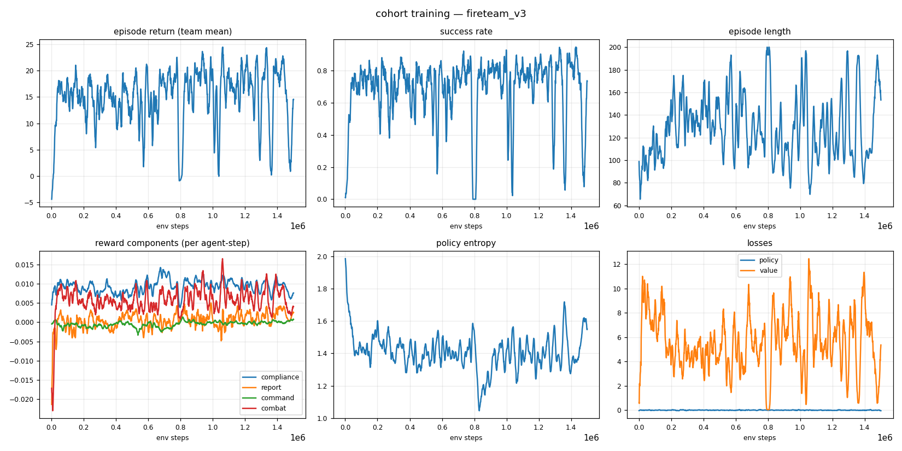
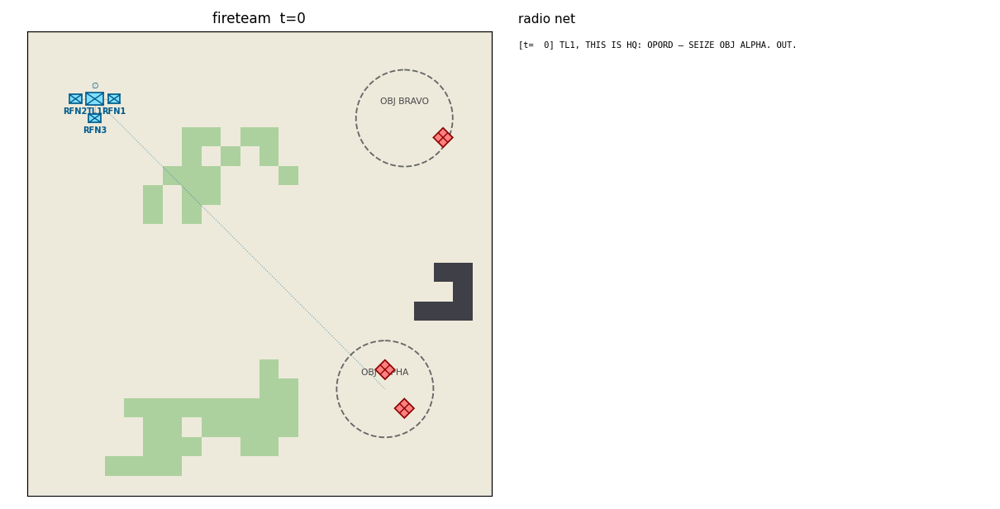
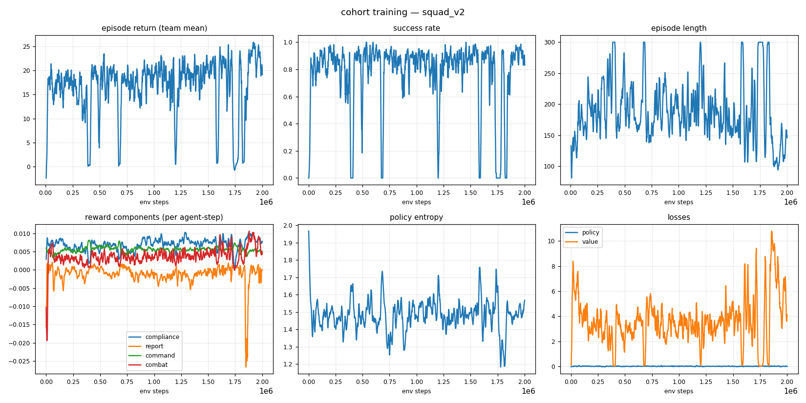
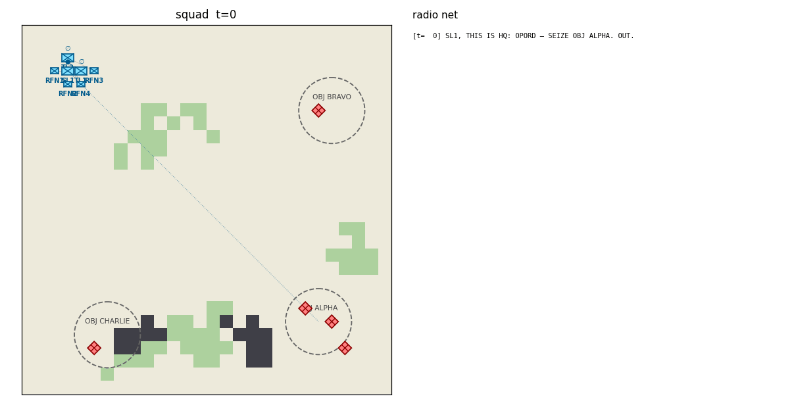
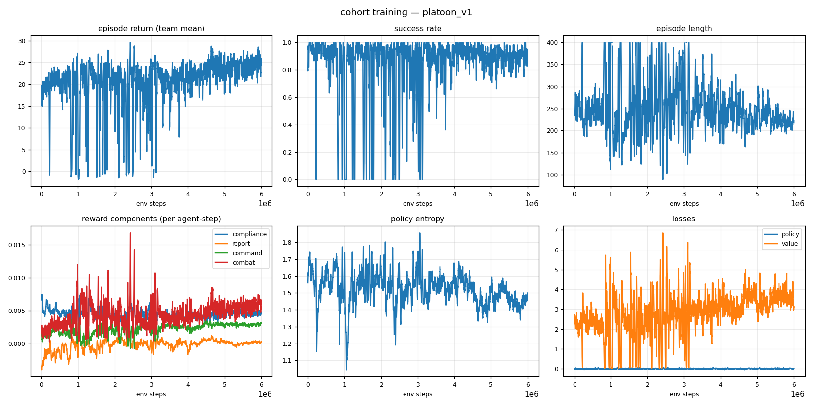
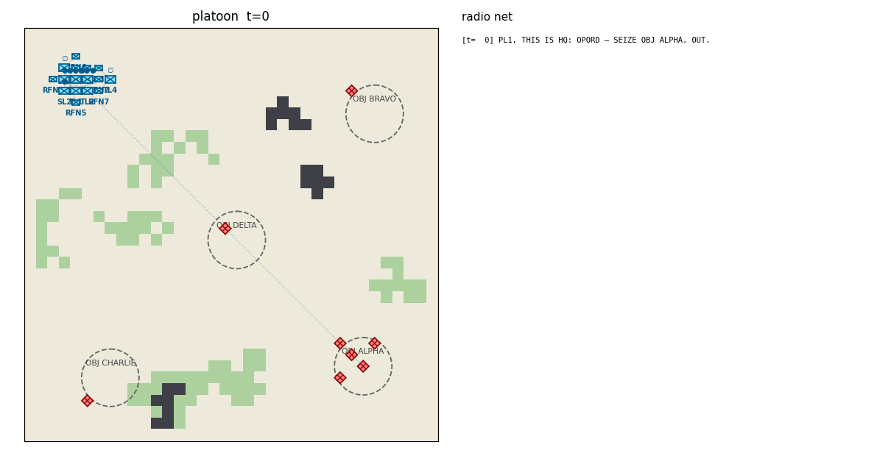

# cohort — a transparent chain-of-command for multi-agent RL


A military cohort of NATO-ranked agents learns to behave the way soldiers of their rank
should: **obey** standing orders, **report** what they see up the chain, **derive**
doctrine-valid orders for their subordinates, and fight as a team — while every order and
report is a human-readable radio message in NATO voice procedure. A human commander can
read the entire command flow of an episode as plain radio traffic, and can *speak the
same language back*:

```
[t=  0] SL1, THIS IS HQ: OPORD — SEIZE OBJ ALPHA. OUT.
[t=  1] TL2, THIS IS SL1: OVERWATCH OBJ ALPHA. OUT.
[t=  1] SL1, THIS IS TL2: WILCO. OUT.
[t= 11] SL1, THIS IS TL1: CONTACT, GRID 2106, 1 x ENEMY. OVER.
[t= 87] ALL STATIONS: TL1 IS DOWN. OUT.
[t= 87] ALL STATIONS, THIS IS RFN1: TL1 IS DOWN. I AM ASSUMING COMMAND. OUT.
[t=112] HQ, THIS IS RFN1: SEIZE OBJ ALPHA — COMPLETE. OVER.
[t=112] RFN1, THIS IS HQ: ROGER, SEIZE OBJ ALPHA CONFIRMED. OUT.
```

The same sentence a human types — `TL1, seize obj bravo` — is parsed, validated against
rank authority, and lands as a mission on the agent, which the trained policy then executes.

## What is guaranteed vs. what is learned

The core design split: **admissibility is enforced, behavior is trained.**

| Enforced by action masking (hard guarantee) | Learned by RL (reward-shaped) |
|---|---|
| A rifleman (RFN) can never issue an order | *When* to move, fire, take cover |
| Leaders can only order their own direct subordinates | *Which* doctrine-valid order fits the situation |
| Orders must be doctrine-derivable from the leader's own mission | Reporting contacts promptly (only *new* intel pays) |
| You cannot FIRE without a visible target, or report a contact you cannot see | Honest MISSION COMPLETE reports (false claims are penalized) |
| MISSION COMPLETE only for missions that have an end state | Keeping every subordinate tasked, avoiding order churn |

## Ranks (NATO, STANAG 2116 grades)

| Callsign prefix | Position | Grade | Authority | Commands |
|---|---|---|---|---|
| CO | Company Commander | OF-2 | 6 | ✔ |
| XO | Executive Officer (deputy of CO) | OF-2 | 5 | ✔ |
| PL | Platoon Leader | OF-1 | 4 | ✔ |
| PSG | Platoon Sergeant (deputy of PL) | OR-7 | 3 | ✔ |
| SL | Squad Leader | OR-6 | 2 | ✔ |
| TL | Fire Team Leader | OR-5 | 1 | ✔ |
| RFN | Rifleman | OR-3 | 0 | ✖ executes, reports, communicates |

**Succession**: when a leader falls, command devolves automatically — the designated
deputy (XO/PSG), or the senior living direct subordinate, assumes the fallen leader's
*position*: their effective rank, their subordinates, and their standing mission. The
vacancy the successor leaves behind is filled the same way, recursively, and each
promotion is announced on the net (`I AM ASSUMING COMMAND`). A rifleman can end up
commanding a squad — and the action mask expands with the acting rank.

## Missions and doctrine (NATO tactical tasks)

Orders carry one of seven tasks: `RECON` (reconnoiter), `SEIZE`, `DEFEND`, `OVERWATCH`
(support by fire), `CLEAR` (eliminate enemy at an objective), `RALLY` (assemble on the
leader), `HOLD` (hold position). A leader may only derive subordinate tasks that doctrine
allows from its *own* current mission (preference-ordered):

| Own mission | May order subordinates to… |
|---|---|
| RECON | RECON, OVERWATCH, HOLD |
| SEIZE | SEIZE, CLEAR, OVERWATCH |
| DEFEND | DEFEND, OVERWATCH, HOLD |
| OVERWATCH | OVERWATCH, HOLD |
| CLEAR | CLEAR, OVERWATCH |
| RALLY | RALLY, HOLD |
| HOLD | HOLD, OVERWATCH |

The doctrine table lives in [`cohort/core/missions.py`](cohort/core/missions.py) — edit it
and the action masks, rewards, and behavior all follow.

## Quickstart

```bash
python -m venv .venv && source .venv/bin/activate
pip install -r requirements.txt

# sanity check
pytest tests/ -q

# train a fire team (TL + 3 RFN) to seize an objective  (~10 min on CPU)
python -m cohort.training.train --scenario fireteam --total-steps 1500000

# evaluate a checkpoint: metrics + episode GIF + radio transcript
python -m cohort.training.evaluate runs/<run>/ckpt_best.pt --episodes 20 \
    --gif episode.gif --transcript episode.txt

# be the commander: type orders, the trained cohort executes
python -m cohort.play --checkpoint runs/<run>/ckpt_best.pt
```

Training writes everything to `runs/<run-name>/`: `metrics.csv`, `training_curves.png`,
TensorBoard logs (`tensorboard --logdir runs`), checkpoints, and a post-training eval GIF.

## Visualizing

### The interactive dashboard

```bash
python -m cohort.viz.dashboard          # opens http://localhost:8787
```

One command, no extra dependencies, works offline. Unit symbology follows **NATO APP-6 /
MIL-STD-2525**: friendly units are blue rectangle frames with the infantry saltire and an
echelon indicator (∅ team, ● squad, ●●● platoon, | company); hostiles are red diamonds;
reported-but-unseen contacts are dashed diamonds (suspected). Two views:

* **Training** — live-refreshing charts for every run in `runs/`: return, success
  rate, episode length, per-component rewards, entropy, losses — usable *while*
  a training run is going.
* **Episode** — simulate an episode with any checkpoint (or the random baseline),
  any scenario, any seed (reproducible), then explore it like a film:
  play/pause/scrub/step, click any **agent** (health, ammo, effective rank with NATO
  grade, mission, the exact action it took, its per-step reward broken into named
  components), any **enemy** (who has spotted it, whether it's been reported onto the
  team picture), any **objective** or terrain cell. Overlay toggles for chain-of-command
  links, mission anchors, health/ammo bars, vision + line-of-sight, the reported
  enemy picture, comm flashes, and movement trails. A synced radio-net log
  (filterable, click a message to jump to its moment) and an event timeline
  (rewards + contacts/orders/casualties) round it out.

It is equally a debugging tool: both reward exploits found during development
are the kind of thing the Episode view makes visible in seconds (an agent's
reward components are shown red/green at every step).

### Without the dashboard (headless / scripting)

```bash
# live scalars (return, success rate, entropy, losses) in the browser
tensorboard --logdir runs
# → http://localhost:6006

# or regenerate the 6-panel dashboard PNG at any moment (works mid-run)
python -m cohort.viz.plots runs/<run-name>
open runs/<run-name>/training_curves.png     # macOS; xdg-open on Linux

# or watch the raw numbers
tail -f runs/<run-name>/metrics.csv
```

### Watching trained agents

Checkpoints (`ckpt_best.pt`, `ckpt_latest.pt`) are self-contained and reloadable: they
store the model weights plus the network/space metadata and scenario name needed to
rebuild the policy (`cohort.training.train.load_policy`). `ckpt_best.pt` is the rolling
best by success rate; `ckpt_latest.pt` the most recent iteration.

```bash
# metrics over N episodes + an animated GIF + the full radio transcript of one episode
python -m cohort.training.evaluate runs/<run-name>/ckpt_best.pt \
    --episodes 20 --gif episode.gif --transcript episode.txt
open episode.gif        # APP-6 map + live radio net sidebar
cat episode.txt         # the episode as pure radio traffic

# compare against the untrained baseline
python -m cohort.training.evaluate --random --scenario fireteam

# watch + steer it live in the terminal: type orders, read the net
python -m cohort.play --checkpoint runs/<run-name>/ckpt_best.pt
```

A checkpoint trained on one scenario can be loaded in any other (identical observation
and action spaces): `python -m cohort.play --checkpoint runs/fireteam_v3/ckpt_best.pt
--scenario squad` works — and `--init-from` continues training from any checkpoint.

## The command language (NATO voice procedure)

Formatting and parsing are inverses — anything an agent says as an order, you can type:

```
TL1, seize obj alpha           → SEIZE at objective ALPHA
rfn2: rally on me              → RALLY
RFN1, hold position            → HOLD in place
TL2, cover obj bravo           → OVERWATCH (synonyms: cover, support)
TL1, hold obj alpha            → DEFEND (holding a *place* ≠ holding position)
```

Synonyms: `take/capture/assault/secure → SEIZE`, `destroy/attack/engage/eliminate/
neutralize/fix → CLEAR`, `scout/observe → RECON`, `guard/retain → DEFEND`,
`regroup/assemble/return → RALLY`, `halt/stop → HOLD`. Reports use ACP-125-style
prowords (THIS IS, WILCO, OVER, OUT, ALL STATIONS) and four-digit GRID references.
Rank rules apply to humans too: playing as `TL1` you can order your riflemen, not the
squad leader above you (`PermissionError`). As `HQ` you can order anyone.

## Environment

`CohortEnv` is a [PettingZoo](https://pettingzoo.farama.org) `ParallelEnv` (agent ids are
callsigns). Per agent, per step:

* **Observation** (`Box(131,)` + action mask): own state incl. *effective* rank, standing
  mission + anchor direction, leader, direct subordinates (+ who reported contact),
  currently visible enemies, objectives, comms summary, and a 5×5 terrain patch.
  Crucially, the *team* enemy picture contains only enemies someone has **reported** —
  reporting is instrumentally useful, not just reward-bait.
* **Actions** (`Discrete(97)`, masked): STAY, 4 moves, FIRE, REPORT CONTACT / SITREP /
  MISSION COMPLETE, and 88 order actions (subordinate slot × mission × objective).
* **Rewards** (per agent, decomposed and logged): mission compliance shaping, new-intel
  contact reports, truthful completion reports, doctrine-preferred orders + subordinate
  coverage, combat events, shared terminal success/defeat. Component means are plotted
  per run so you can see *why* the cohort improves.
* **Comms model** (`ScenarioSpec.comm_model`): `"global"` (default) is a single
  perfectly reliable net — every station hears everything. `"range"` makes audibility
  per-listener (euclidean `comm_range`; HQ is a high-power station): CONTACT reports
  feed only the pictures of stations in earshot, and an order to an out-of-earshot
  subordinate is transmitted but never received — no WILCO comes back, so silence
  carries information.
* **Completion reporting is load-bearing**: when the root-mission success condition is
  first met, the episode stays open for a short window (`ScenarioSpec.grace_window`,
  default 12 steps). A truthful `MISSION COMPLETE` from the senior agent — judged
  against the *team* end state and confirmed by HQ on the net — ends the episode that
  step and earns a bonus; otherwise the episode ends as a success at the window's close
  (speed bonus anchored at the moment the condition was met, so winning never depends
  on reporting — but reporting is what ends the operation *on the net*).

### Scenarios

| Name | Org | Agents | Mission |
|---|---|---|---|
| `fireteam` | TL + 3 RFN | 4 | SEIZE OBJ ALPHA (garrisoned) |
| `fireteam_defend` | TL + 3 RFN | 4 | DEFEND OBJ ALPHA vs. OpFor assault |
| `squad` | SL + 2 fire teams | 7 | SEIZE with two-echelon command |
| `squad_recon` | SL + 2 fire teams | 7 | RECON OBJ BRAVO without engaging |
| `platoon` | PL + PSG + 2 squads | 16 | SEIZE with three-echelon command |

Add scenarios in [`cohort/config.py`](cohort/config.py) (org chart, map, OpFor, OPORD).

## Training

Self-contained, dependency-light **masked PPO** (PyTorch, no RLlib): one parameter-shared
actor-critic MLP for all agents — rank, mission, and org context live in the observation,
so the network learns *rank-conditional* behavior. Masks are applied at the distribution
level, so admissibility holds during exploration, not just at convergence. Agent death
mid-episode, succession, and truncation bootstrapping are handled in the GAE buffer.

### Results (fireteam, 1.5M steps, ~6 min on a laptop CPU)

See `runs/fireteam_v3/` — **86% ± 7** evaluation success (95% CI, N=100 episodes), and
the operation now *ends on the net*: in 67 of 86 successful episodes the transcript
closes with the root's completion report and HQ's confirmation —

```
[t= 90] HQ, THIS IS TL1: SEIZE OBJ ALPHA — COMPLETE. OVER.
[t= 90] TL1, THIS IS HQ: ROGER, SEIZE OBJ ALPHA CONFIRMED. OUT.
```

(~5.5 DONE reports per episode; the pre-v1.2 checkpoints never transmitted one.
The earlier run is kept in `runs/fireteam_v2/`.)





The eval GIF shows the map (APP-6 unit symbols, chain-of-command links, mission anchors)
side by side with the live radio net. The full transcript of the episode is written to
`eval_transcript.txt`.

### Results (squad — two command echelons, 7 agents)

`runs/squad_v2/` — **97% ± 3** success (95% CI, N=100). The SL receives the OPORD, tasks
its two fire-team leaders, and the TLs task their riflemen; the same shared network
plays all three roles, and the SL reports MISSION COMPLETE up to HQ when the operation
is won (44 of 97 successes close with the report; ~5.6 DONE reports per episode).
The earlier run is kept in `runs/squad_v1/`.





### Results (platoon — three command echelons, 16 agents)

`runs/platoon_v1/` — **93% ± 5** success (95% CI, N=100, re-evaluated under the v1.2
environment), trained by curriculum from the squad checkpoint (6M steps at `--lr 1e-4`).
The full chain activates within ~16 steps of the OPORD: HQ → PL1, PL1 tasks PSG1/SLs,
SLs task their TLs, TLs task their riflemen — one shared network playing every echelon:





Curriculum tip: checkpoints are scenario-compatible (same spaces) — train `fireteam`
first, then `--init-from runs/fireteam_v3/ckpt_best.pt` for `squad`, and so on up to
`platoon` (use a lower `--lr` when fine-tuning a converged checkpoint).

## Project layout

```
cohort/
  config.py            scenario presets + org chart builders
  core/
    ranks.py           NATO rank ladder, STANAG grades, deputies, echelon marks
    missions.py        NATO tactical tasks, doctrine, compliance & completion semantics
    orders.py          radio messages + episode transcript
    language.py        command-language formatter/parser (NATO voice procedure)
    units.py           soldiers, org roster, OpFor, combat, succession
    world.py           terrain grid, LOS, objectives, procedural maps
  env/
    actions.py         global action catalog + per-rank legality masks
    observations.py    per-agent observation builder
    rewards.py         reward weights + per-component ledger
    cohort_env.py      the PettingZoo ParallelEnv
  training/
    ppo.py             masked PPO + GAE buffer (handles agent death)
    train.py           training CLI, metrics, checkpoints, --init-from
    evaluate.py        eval CLI, GIF + transcript export
  viz/                 APP-6 frame renderer, GIF writer, training curves,
                       interactive dashboard (dashboard.py + dashboard.html)
  play.py              interactive commander console
tests/                 100 tests: ranks, language, doctrine, succession, masking,
                       PettingZoo API, rewards, combat, completion reporting,
                       comms range, SITREP cadence, dashboard, training smoke
legacy/                the previous (RLlib-based) implementation, archived
```

## Roadmap

Planned work and its advancement are tracked in [ROADMAP.md](ROADMAP.md) — current
flagship item: training the three-echelon `platoon` scenario by curriculum.

## Provenance

This project is a ground-up rewrite of an older RLlib-based attempt (preserved in
[`legacy/`](legacy/)). The domain model — a ranked chain of command with doctrine-derived
order decomposition — carries over; the original French rank nomenclature (CDU/CDS/CDG…)
was translated to NATO standards (ranks, tactical tasks, voice procedure, APP-6
symbology) in v1.1. The environment, training stack, command language, succession, and
tests are new.
