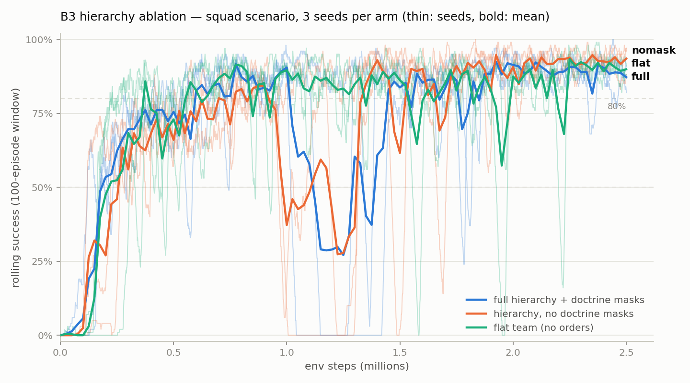

# Hierarchy ablation (B3)

**Claim under test**: structured command — the rank hierarchy plus doctrine-
constrained order masks — improves sample efficiency and/or final performance,
and buys interpretability, over the same policy network without the structure.

Three arms, same parameter count (one shared `PolicyNet(137, 157)` in every
arm — spaces are frozen; the arms are masking-only env knobs,
`ScenarioSpec.ablation`), trained **from scratch** on the SQUAD scenario
(SL + 2 fire teams seize OBJ ALPHA, garrisoned OpFor), 3 seeds per arm
(3, 5, 7), 2.5M env steps each, identical PPO hyperparameters (defaults:
lr 3e-4 annealed, ent 0.01, KL guard 0.02), no curriculum — a fair-start
comparison. Runs: `runs/squad_abl_{full|nomask|flat}_s{seed}/`.

## The arms — exactly what changes

| | (i) `full` | (ii) `nomask` | (iii) `flat` |
|---|---|---|---|
| scenario preset | `squad` | `squad_nomask` | `squad_flat` |
| order mask | rank admissibility + doctrine derivation + cooldown (the shipped system) | rank admissibility + cooldown; **doctrine-derivation constraint removed** — a leader may issue any rank-admissible order regardless of its own mission, even with none | **all order actions masked off, for everyone** |
| tasking at reset | HQ OPORD to the root only; missions cascade by learned orders | same as full | **every agent receives the OPORD mission directly** (all-tasked; one OPORD per agent on the transcript; the root keeps the team-adjudicated #9 semantics, the rest hold personal tasks) |
| comms | reports + orders | reports + orders | **reports only** (CONTACT / SITREP / DONE) |
| reward changes | none | **none** — order-quality bonuses still pay more for doctrine-preferred derivations (doctrine remains a *soft* signal; only the hard constraint is removed) | **leader coverage neutralized** (`coverage_bonus`/`coverage_gap` not paid): with everyone OPORD-tasked at reset the bonus would pay for free, and the gap would punish agents whose truthful DONE cleared a mission nobody can re-issue. Order-quality/churn rewards are unreachable (no orders). Everything else — compliance, reports, combat, death economics (rank-weighted, human commander), terminal — identical |
| everything else | — | identical: env dynamics, OpFor, maps, net arbitration, succession protocol, observation layout | identical (succession still runs as roster bookkeeping; rank-weighted death penalties stay, keeping combat magnitudes comparable) |

Verified by test (`tests/test_ablation.py`): the default arm is bit-identical
to the shipped system; spaces are Discrete(157)/Box(137) in every arm; nomask
opens doctrine-invalid orders while RFN order vocabularies stay empty and
per-echelon hold authority (DENY) and the cooldown still mask; flat never has
a legal order action for anyone and pays no command reward.

## Results

Nine runs (2026-08-06), all nine reached 2.5M steps with a gated `ckpt_best`
(the D4 full-window rule); every evaluation below is on `ckpt_best.pt`.



### Sample efficiency and final success

Mean ± sd across the three seeds; per-seed values in parentheses.

| | full | nomask | flat |
|---|---|---|---|
| steps to sustained 50% (k) | **157 ± 32** (174/120/176) | 201 ± 75 (263/222/118) | 213 ± 80 (305/164/170) |
| steps to sustained 80% (k) | 436 ± 30 (403/442/463) | 583 ± 182 (413/775/562) | **310 ± 80** (402/270/258) |
| final rolling success | 0.87 ± 0.05 | 0.94 ± 0.05 | 0.90 ± 0.02 |
| **success, N=100 (95% CI per run)** | **0.92 ± 0.01** (91±6 / 93±5 / 91±6) | 0.91 ± 0.03 (93±5 / 87±7 / 92±5) | 0.85 ± 0.06 (89±6 / 78±8 / 87±7) |
| defeats (squad wiped) / 100 eps | 5.0 ± 1.0 | 4.7 ± 0.6 | **11.0 ± 5.3** |
| mean survivors / 7 | 4.13 | 4.42 | 4.07 |

Training stability: **six of the six hierarchy-arm seeds** hit a deep
transient collapse (rolling < 0.1) between 0.99M and 1.37M steps and
self-recovered under the annealed LR + KL guard; flat hit one (seed 7,
1.58M). All nine recovered; the gated `ckpt_best` selection was unaffected.
The concentration of collapse onsets in the order-capable arms is a new D4
data point (all arms share the same death economics, so death shocks alone
do not explain the asymmetry).

### Interpretability (B2 behavior suite, N=30, seeds 500–529)

`†` = structurally degenerate for that arm, reported for completeness.

| | full | nomask | flat |
|---|---|---|---|
| agent-issued orders / 30 eps | 2212 ± 190 | 2136 ± 471 | 0 † (no orders exist) |
| **doctrine-valid order rate** | **1.000** (mask-guaranteed) | 0.395 ± 0.079 | — |
| doctrine-preferred rate | **0.459 ± 0.076** | 0.166 ± 0.037 | — |
| orders issued by unmissioned leaders (90 eps) | 0 (impossible) | 109 | — |
| obedience latency (steps) | 2.41 ± 0.04 | 2.41 ± 0.32 | 1.50 ± 0.32 † (OPORDs only) |
| report precision / recall | 0.14 / **0.96** | 0.22 / 0.89 | 0.21 / 0.90 |
| DONE claims / 30 eps | **128 ± 111** | 0.3 ± 0.6 | 1.0 ± 1.0 |
| false-COMPLETE rate | 0.64 ± 0.12 | — (≤1 claim) | — (≤2 claims) |
| coverage time | 0.969 | 0.968 | 1.000 † (all-tasked by construction) |
| human commander death rate | **0.178 ± 0.051** | 0.189 ± 0.069 | 0.256 ± 0.126 |

The doctrine-validity probe replays the 30 protocol episodes per run and
judges every agent-issued order against `allowed_derivations` of the
issuer's mission at transmission (for full this is 1.0 *by construction* —
the mask). What the numbers look like on the net, same seed (500), first
order traffic of the episode:

```
full    [t=0] SL1, THIS IS HQ: OPORD — SEIZE OBJ ALPHA. OUT.
        [t=1] TL1, THIS IS SL1: OBSERVE OBJ BRAVO. OUT.      ← SEIZE-derivable
        [t=2] RFN1, THIS IS TL1: HOLD POSITION. OUT.

nomask  [t=0] SL1, THIS IS HQ: OPORD — SEIZE OBJ ALPHA. OUT.
        [t=1] TL1, THIS IS SL1: SCREEN OBJ BRAVO. OUT.       ← not derivable from SEIZE
        [t=2] RFN1, THIS IS TL1: RECON OBJ CHARLIE. OUT.     ← off-mission objective
        [t=3] RFN3, THIS IS TL2: SEIZE OBJ CHARLIE. OUT.     ← TL2 holds no mission yet

flat    [t=0] HQ issues the same OPORD to all seven stations; no order
        traffic ever follows — the net carries only CONTACT/SITREP.
```

A reader of the full arm's net can reconstruct the plan (every order is a
legal decomposition of the OPORD); the nomask net is 60% doctrine-noise;
the flat net explains nothing because nothing is decided on it. Completion
reporting (#3) only survives in the full arm (≈4.3 DONE/ep vs ≈0): with the
whole order vocabulary open, the learned policies abandoned the DONE
channel entirely.

## Conclusion — the claim, honestly scored

**Final performance: supported vs flat, tied within hierarchy.** Both
hierarchy arms beat the flat team by ~6 pts at N=100 (0.92/0.91 vs 0.85)
with far tighter seed spread (±0.01/±0.03 vs ±0.06); the flat team wipes
2.2× as often (11 vs 5 defeats per 100) and loses the human commander more
(0.26 vs 0.18) — with no re-tasking, a flat team cannot reorganize once its
initial plan degrades. Doctrine masks vs no masks is a wash on final
success (0.92 vs 0.91, inside the CIs).

**Sample efficiency: NOT supported vs flat; supported within hierarchy.**
The flat team is *fastest* to sustained-80% (310k vs full's 436k): it skips
the command-learning problem because complete tasking arrives free at
reset. That is the honest reading — on a 7-agent scenario whose whole plan
fits in one OPORD, giving everyone the objective is a strong baseline.
Within the hierarchy arms, doctrine masks clearly help: full reaches 80% in
436 ± 30k vs nomask's 583 ± 182k — pruning ~60%-doctrine-noise from the
order space makes command learnable faster and far more consistently.

**Interpretability: strongly supported.** Only the full arm yields a net
that explains the behavior: 100% doctrine-valid traffic (guaranteed), 2.8×
the doctrine-preferred rate of nomask, and the only surviving completion
reporting. This is measured, not asserted (tables above).

**Verdict**: structured command pays for itself in *final outcome
robustness* and *interpretability*, not in raw sample efficiency on a
scenario this small. The open follow-up is depth: at platoon scale (16
agents, 3 echelons) a single broadcast OPORD cannot encode the plan —
the flat baseline should be rerun there before the efficiency half of the
claim is abandoned.

## Artifacts

* Runs: `runs/squad_abl_{full|nomask|flat}_s{3,5,7}/` — `metrics.csv`,
  `config.json`, `ckpt_best.pt`, `training_curves.png`, `behavior.json`
  (B2 protocol).
* Figure: `docs/ablation_curves.png` (regenerable from the metrics.csvs).
* Doctrine-validity probe + per-arm transcripts: campaign tooling (not
  committed); the probe logic is `cohort/metrics.py::_doctrine` extended
  from "preferred" to "allowed", over the same recorded traces.

## Method notes

* **steps-to-X%**: first `env_steps` at which the 100-episode rolling success
  is ≥ X for 10 consecutive training iterations (~10k env steps) — "sustained",
  so a single lucky window does not count. From `runs/<run>/metrics.csv`.
* **final success**: N=100 evaluation episodes (sampled policy, eval seed 123)
  on the selected checkpoint (`ckpt_best.pt` under the D4 full-window gate,
  else the final checkpoint), reported ± 95% CI.
* **behavior suite**: the B2 protocol — N=30, seeds 500–529 (`behavior.json`
  per run). Order/coverage metrics are structurally degenerate for `flat`
  (its only order events are the reset OPORDs; coverage is all-tasked by
  construction) — reported for completeness, read with that in mind.
